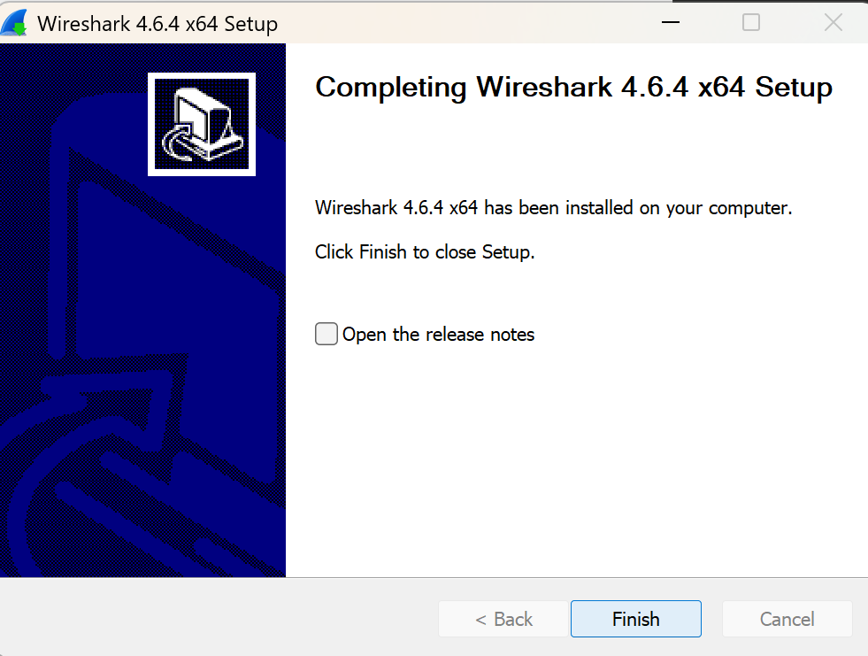
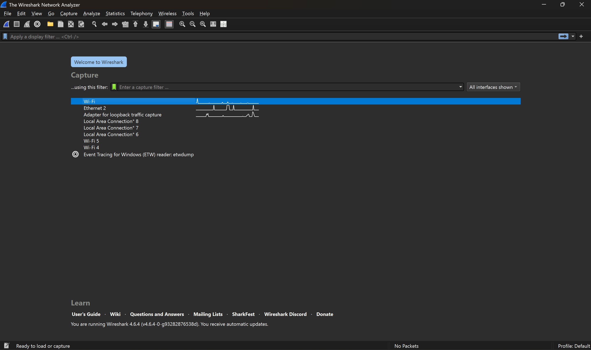
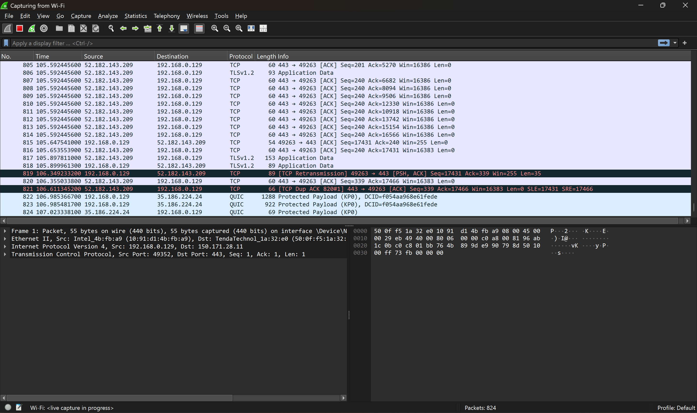
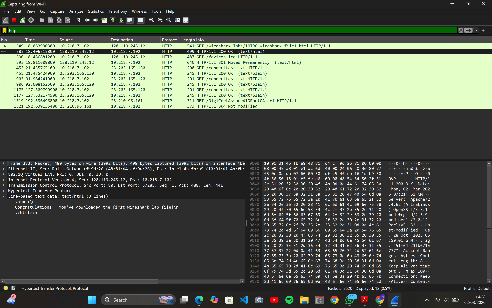

# Laporan Praktikum Modul 1 dan 2

## Tujuan Praktikum

1. Melakukan instalasi Wireshark
2. Menggunakan Wireshark untuk menangkap dan mengidentifikasi paket data

## Instalasi Wireshark

1. Pertama, install Wireshark melalui link berikut ini:
   [Download Wireshark](https://www.wireshark.org/download.html)
2. Selanjutnya, lakukan set up seperti tampilan di bawah ini
   
   . Lakukan setup hingga finish!
   
3. Wireshark berhasil di install!

## Wireshark

Saat menjalankan Wireshark, kita akan melihat tampilan awal seperti berikut.

Secara garis besar, berikut adalah bagian dari tampilan tersebut:

1. Daftar Interface (Capture)
   Pada bagian tengah yang berisi daftar seperti Wi-Fi, Ethernet 2, dan Adapter for loopback adalah daftar kartu jaringan (network interface) yang terdeteksi di laptop saya.
2. Capture FIlter
   Kotak yang berada di atas daftar interface digunakan untuk menangkap data tertentu(misalnya dari alamat IP tertentu)
3. Toolbar (Ikon di atas)
   Dereta ikon pada bagian kiri atas adalah kendali utama:
   -Sirip hiu biru: untuk memulai menangkap paket data pada interface yang dipilih
   -Kotak merah: untuk menghentikan proses penangkapan
   -Petir hijau: untuk mengulang sesi penangkapan dari awal

Selanjutnya, kita akan menangkap dan mengidentifikasi paket data dengan menekan 2 kali Wi-Fi pada daftar interface. Tampilannya akan seperti berikut:

Antarmuka WIreshark memiliki lima komponen utama:

1. **command line** adalah menu pull-down standar yang terletak di bagian atas jendela Wireshark.
2. **packet-listing window** (terletak di bagian tengah) berfungsi untuk menampilkan ringkasan satu baris untuk setiap paket yang diambil, termasuk nomor paket saat ditangkap, sumber paket dan alamat tujuan, jenis protokol, dan informasi khusus protokol yang terdapat pada paket.
3. **packet-header details window** (terletak di bagian bawah kiri) berfungsi untuk memberikan rincian tentang paket yang dipilih di jendela daftar paket. Untuk memilih paket di jendela daftar paket, letakkan kursor di atas ringkasan satu baris paket di window daftar paket dan klik.
4. **packet-contents window** (terletak di bagian bawah kanan) berfungsi untuk menampilkan seluruh isi frame yang di ambil, baik dalam format ASCII maupun heksadesimal.

## Tes Run

1. Langkah pertama, pilih menu Capture, klik Options, lalu pilih Wi-Fi, lalu start. (pastikan laptop terhubung ke wifi)
2. Saat Wireshark sedang berjalan, masukkan URL <http://gaia.cs.umass.edu/wiresharklabs/INTRO-wireshark-file1.html> dan tampilkan halaman tersebut pada browser. Selanjutnya refresh.
3. Kembali ke Wireshark, ketik 'http' (tanpa tanda petik dan huruf kecil) lali klik enter.
4. Temukan baris paket yang sesuai dengan url yang dimasukkan. (cari yang text/html). Maka, akan terlihat tampilan seperti berikut.
   
5. Selesai.

## Kesimpulan

Praktikum ini menunjukkan proses instalasi Wireshark dan penggunaan antarmuka utamanya untuk melakukan analisis jaringan. Melalui pemahaman fungsi antarmuka serta penggunaan filter yang tepat, kita dapat dengan mudah menangkap, menyaring, dan mengidentifikasi paket data spesifik di dalam jaringan. Hal ini memberikan gambaran jelas mengenai bagaimana data dikirimkan dan diproses dalam sebuah komunikasi jaringan.
