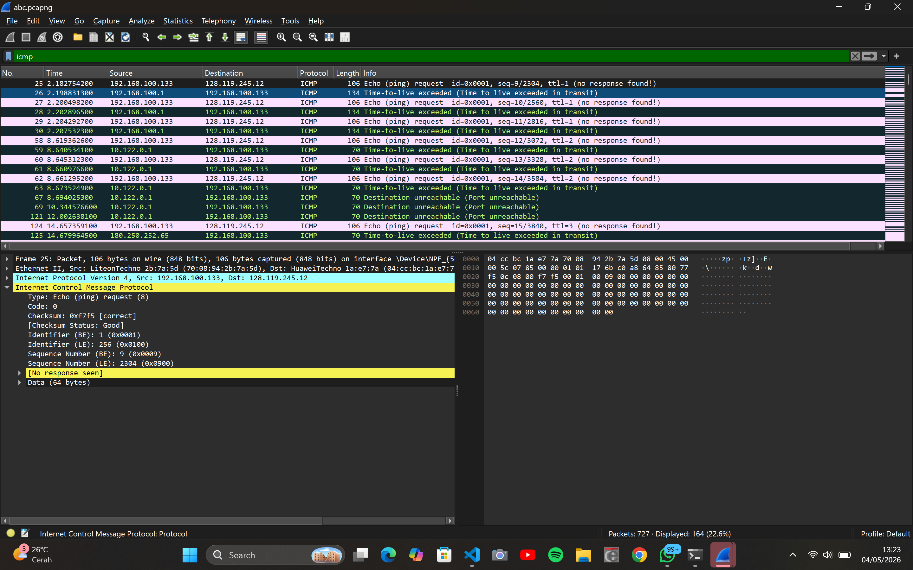
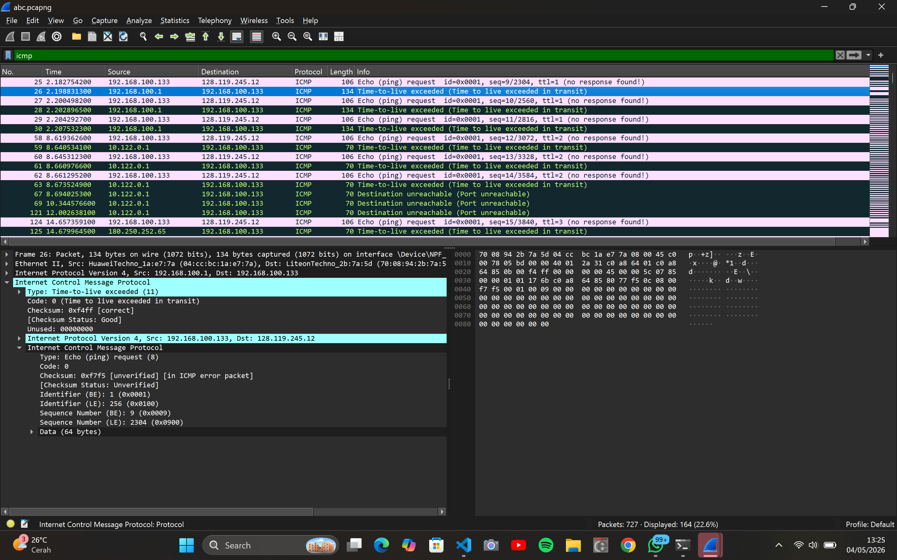
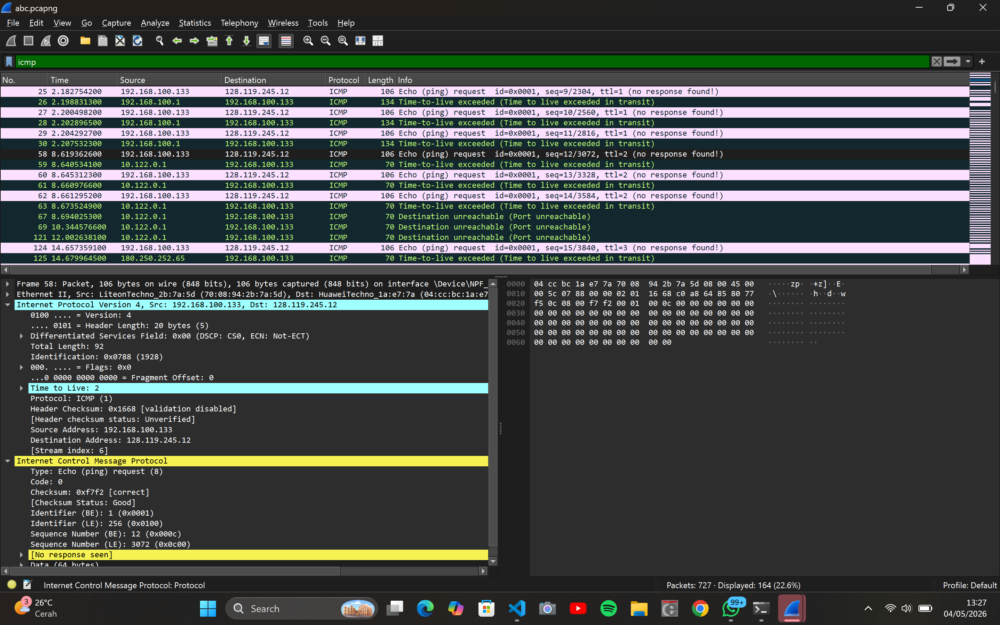
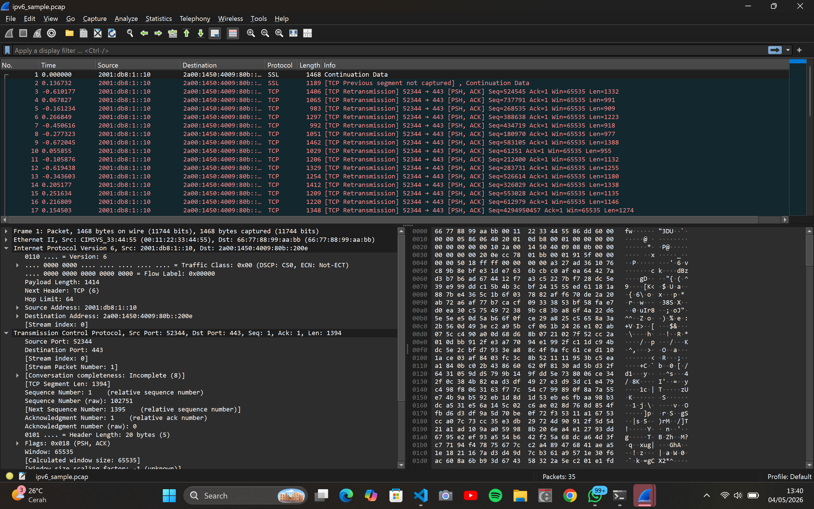

# Laporan Praktikum Modul 10: IP

## Tujuan

1. Mampu menginvestigasi ca2a kerja protokol IP menggunakan Wireshark

## Analisis Traceroute/ICMP (IPv4 Dasar)

Pada file tangkapan abc.pcapng, dilakukan pengamatan terhadap aktivitas pesan ICMP. Dari hasil filter display icmp, dapat diidentifikasi pola komunikasi sebagai berikut:

- ICMP Echo Request:
  - Source IP: 192.168.100.133 | Destination IP: 128.119.245.12
  - Protokol: ICMP (Type 8 - Echo request)
  - Kondisi: Paket ini dikirim dengan identifier dan sequence tertentu, namun tertulis [No response seen] pada urutan awal karena dirancang untuk memicu batas TTL pada hop terdekat.

- ICMP Time-to-live exceeded:
  - Source IP: 192.168.100.1 (IP dari router hop pertama)
  - Destination IP: 192.168.100.133 (Komputer Praktikan)
  - Detail Header IP: Nilai Time to Live: 2 (pada beberapa pengiriman lanjutan) atau TTL habis di perjalanan saat mencapai router perantara.
  - Pesan Kesalahan: Di dalam protokol ICMP, tertera Type: 11 (Time-to-live exceeded) dan Code: 0 (Time to live exceeded in transit). Ini membuktikan bahwa router pertama sukses merespons balik ketika TTL paket kiriman habis.

- Peningkatan TTL:
  Ketika melangkah ke hop berikutnya, sistem mengirimkan paket kembali dengan menaikkan nilai TTL. Terlihat pada detail Internet Protocol Version 4, nilai Time to Live: 2 digunakan untuk menjangkau router di hop kedua (10.122.0.1) yang kemudian mengembalikan pesan Time-to-live exceeded.

## Analisis IPv6

Pada file tangkapan ipv6_sample.pcap, dilakukan analisis terhadap struktur header protokol IPv6 yang digunakan pada lalu lintas data TCP/SSL.

- Alamat Asal & Tujuan:
  - Source IPv6: 2001:db8:1::10 (Alamat pengirim paket).
  - Destination IPv6: 2a00:1450:4009:80b::200e (Alamat tujuan paket).
- Hasil Analisis Wireshark:
  - Version (6): Menunjukkan bahwa paket data ini menggunakan protokol komunikasi versi 6 (IPv6).
  - Payload Length (1414 Bytes): Menunjukkan ukuran total data/muatan yang dibawa, di luar ukuran header dasar IPv6.
  - Next Header (TCP - 6): Menunjukkan bahwa protokol yang berada langsung di lapisan atas (setelah header IP ini) adalah protokol TCP.
  - Hop Limit (64): Memiliki fungsi yang sama dengan Time-to-Live (TTL) pada IPv4, yaitu membatasi jumlah lompatan rute (router) maksimal sebesar 64 kali agar paket tidak berputar di jaringan selamanya.

## Kesimpulan

Berdasarkan hasil pengujian, dapat disimpulkan bahwa praktikum ini berhasil membuktikan mekanisme kerja protokol IP dalam pengiriman data dan pelacakan rute jaringan. Melalui analisis dengan Wireshark, proses traceroute terbukti memanfaatkan manipulasi nilai Time-to-Live (TTL) secara bertahap pada IPv4 untuk memicu pesan kesalahan ICMP Time-to-live exceeded dari setiap router perantara yang dilewati hingga mencapai tujuan akhir. Selain itu, perbandingan antara kedua versi protokol menunjukkan perbedaan struktural yang signifikan, di mana header IPv6 dirancang dengan kolom yang lebih efisien seperti Next Header dan mengubah istilah TTL menjadi Hop Limit, meskipun keduanya tetap memiliki esensi fungsi yang sama dalam membatasi masa hidup paket di dalam jaringan.
