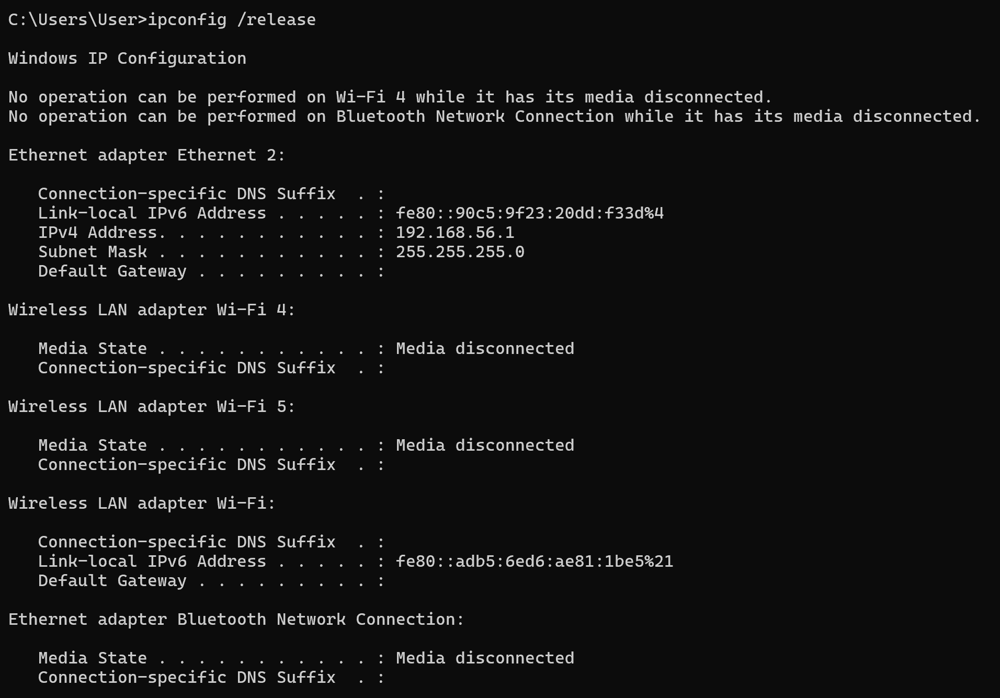
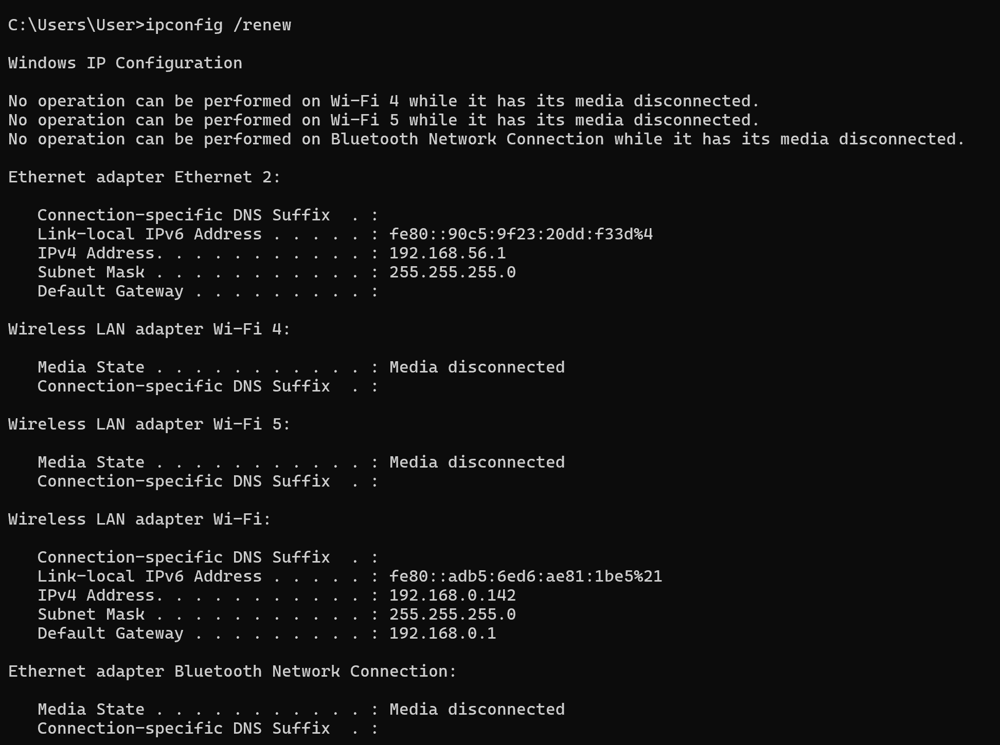
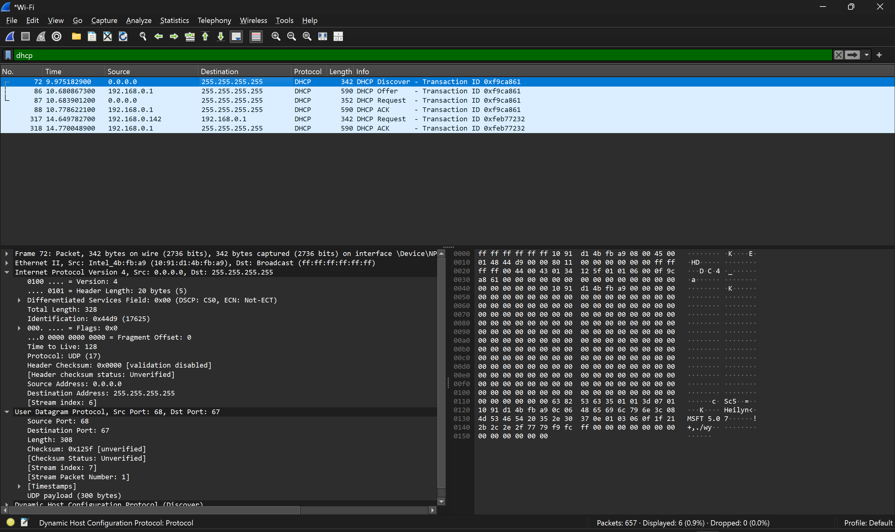

# Laporan Praktikum Modul 11: DHCP

## Tujuan

1. Mampu menginvestigasi cara kerja protokol DHCP menggunakan Wireshark.

## Skema Jabat Tangan DORA

DHCP bekerja pada lapisan aplikasi (Application Layer) menggunakan protokol transport UDP port 67 (server) dan port 68 (client). Protokol ini mengalokasikan parameter jaringan secara otomatis melalui 4 tahapan berurutan:

1. DHCP Discover: Klien melakukan pencarian server secara broadcast (255.255.255.255) karena belum memiliki alamat IP asli (0.0.0.0).
2. DHCP Offer: Server memberikan penawaran alamat IP cadangan kepada klien.
3. DHCP Request: Klien menyetujui tawaran tersebut dan meminta konfirmasi pengalokasian.
4. DHCP ACK: Server mengunci alamat IP tersebut untuk digunakan oleh klien selama masa sewa tertentu (lease time).

## Langkah-Langkah

1. Buka Command Prompt (cmd)
2. Berikan perintah `ipconfig /release` pada cmd
   
3. Jalankan Wireshark
4. Berikan perintah `ipconfig /renew`
   
5. Hentikan Wireshark, lalu cari `dhcp` pada pencarian.
   

## Hasil Analisis

1. User Datagram Protocol (Transport Layer):
   - Source Port: 68
   - Destination Port: 67
2. Alur Proses DORA
   | No Paket | Source IP | Destination IP | Info Pesan (Proses DHCP) |
   | -------- | --------- | -------------- | ------------------------- |
   | 72 | 0.0.0.0 | 255.255.255.255| DHCP Discover (Klien mencari server) |
   | 86 | 192.168.0.1| 255.255.255.255| DHCP Offer (Server menawarkan IP) |
   | 87 | 0.0.0.0 | 255.255.255.255| DHCP Request (Klien meminta IP tersebut) |
   | 90 | 192.168.0.1| 255.255.255.255| DHCP ACK (Server mengonfirmasi sewa IP) |

## Kesimpulan

Berdasarkan hasil investigasi dan analisis paket data yang telah dilakukan menggunakan Wireshark, dapat disimpulkan bahwa protokol DHCP berhasil mengotomatiskan pembagian parameter jaringan pada perangkat melalui skema jabat tangan DORA (Discover, Offer, Request, ACK) secara terstruktur dan efisien.
