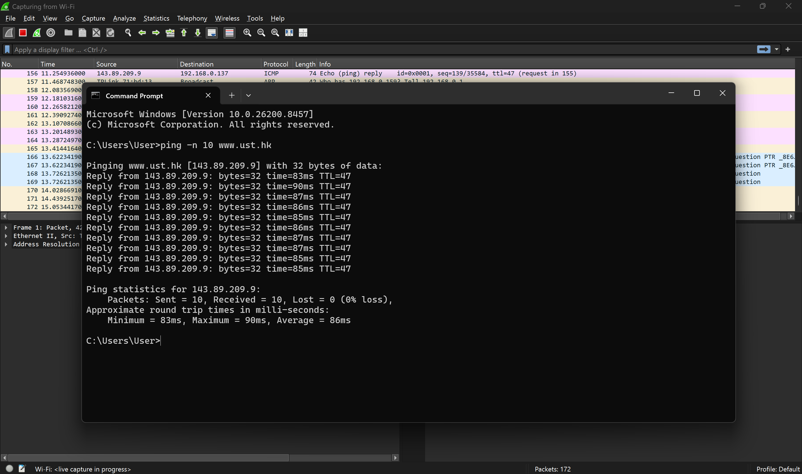
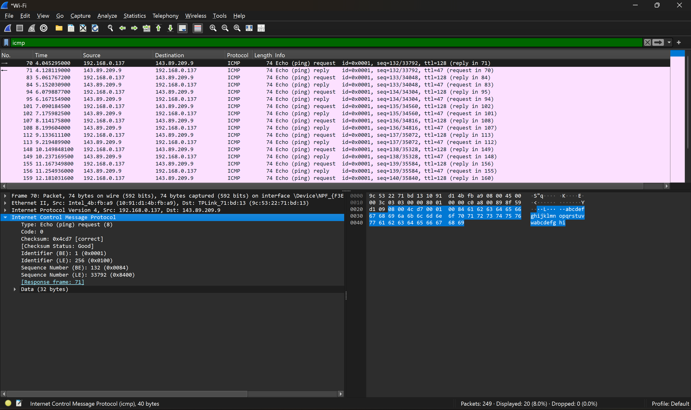
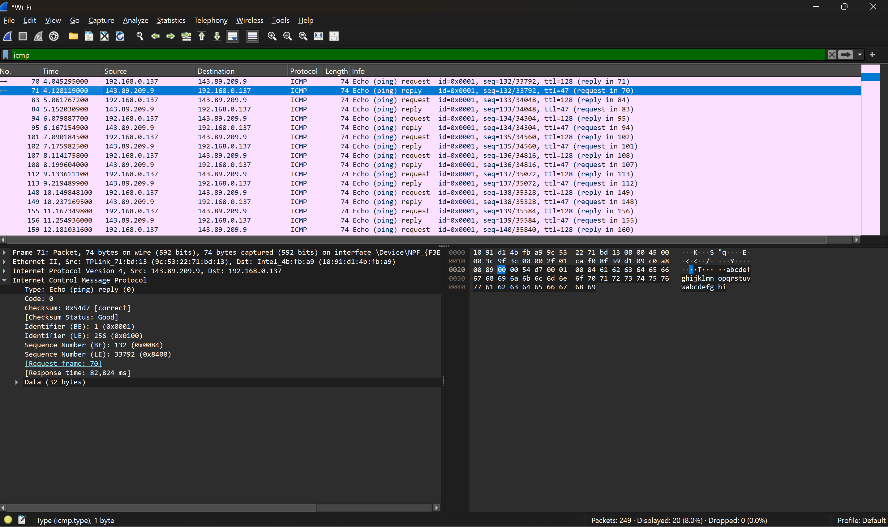
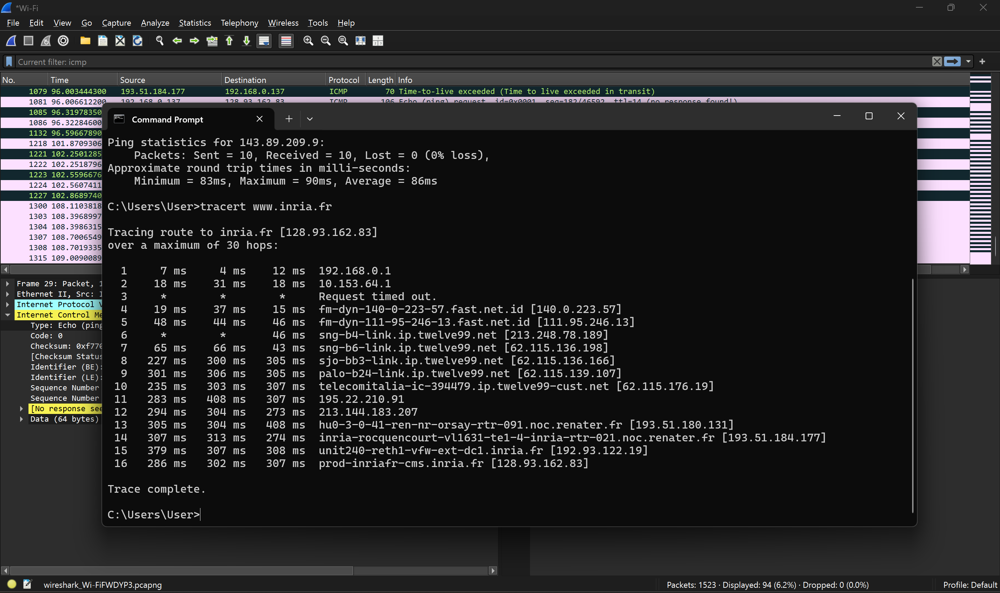
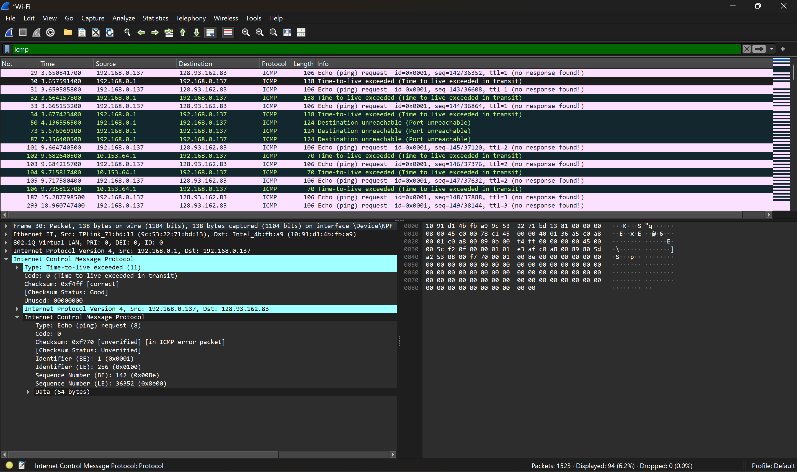

# Laporan Praktikum Modul 12: ICMP

## Tujuan

1. Mahasiswa dapat menginvestigasi cara kerja protokol ICMP menggunakan Wireshark
2. Mahasiswa dapat membuat program ICMP Pinger

## ICMP

ICMP (Internet Control Message Protocol) adalah rangkaian aturan komunikasi yang digunakan perangkat untuk mengomunikasikan kesalahan transmisi data dalam jaringan. Dalam pertukaran pesan antara pengirim dan penerima, kesalahan yang tidak terduga dapat terjadi. Misalnya, pesan mungkin saja terlalu panjang atau paket data mungkin saja tiba secara tidak berurutan sehingga penerima tidak dapat menyusunnya. Dalam kasus tersebut, penerima menggunakan ICMP untuk memberi tahu pengirim melalui pesan kesalahan dan permintaan agar pesan dikirim ulang.

## ICMP dan Ping

1.  Buka Wireshark, lalu start capturing
2.  Buka cmd, lalu berikan perintah `ping -n 10 www.ust.hk` dan tunggu hingga selesai
    
3.  Setelah itu, stop Wireshark. Lakukan pencarian 'icmp' untuk memfilter paket yang icmp saja
    
    - ICMP Echo Request
      - Alur Paket:
        - Source (Sumber): 192.168.0.137 (IP lokal komputer).
        - Destination (Tujuan): 143.89.209.9 (IP server www.ust.hk).
      - Detail Protokol (ICMP):
        - Type: 8 (Echo (ping) request): Tipe angka 8 dalam protokol ICMP menandakan bahwa paket ini adalah permintaan (Request) kiriman dari komputer Anda untuk meminta respons dari server tujuan.
        - Code: 0: Kode 0 mendampingi Tipe 8 untuk memastikan bahwa paket tersebut adalah Echo Request standar.
        - Data (32 bytes): Ini adalah muatan (payload) data acak yang dikirimkan. Di panel sebelah kanan bawah (tampilan hex dump), terlihat bahwa data yang dikirimkan berisi teks alfabet berulang: abcdefghijklmnopqrstuvwabcdefghi. Karakter-karakter ini sengaja dimasukkan oleh sistem operasi Windows sebagai pengisi ruang data 32 byte tersebut.

    
    - ICMP Echo Reply
      - Alur Paket:
        - Source (Sumber): 143.89.209.9 (Server tujuan).
        - Destination (Tujuan): 192.168.0.137.
      - Detail Protokol (ICMP):
        - Type: 0 (Echo (ping) reply): Tipe angka 0 dalam protokol ICMP menandakan bahwa paket ini adalah balasan (Reply) dari server atas permintaan yang dikirimkan pada paket No. 70 sebelumnya.
        - Code: 0: Kode 0 mendampingi Tipe 0 untuk menyatakan balasan berhasil diterima tanpa kendala (Echo Reply sukses).
        - Response time: Wireshark mencatat waktu tunggu balasan ini (Response time) adalah sekitar 82,824 ms (sinkron dengan hasil rata-rata yang tampil pada jendela Command Prompt di gambar pertama).
        - Data: Isi data yang dikembalikan oleh server sama persis dengan yang dikirimkan (abcdefghijklmnopqrstuvwabcdefghi), membuktikan bahwa paket data sampai dan kembali secara utuh tanpa ada yang rusak atau hilang di perjalanan.

## ICMP dan Traceroute

1. Buka Wireshark, lalu start capturing
2. Buka cmd, lalu berikan perintah `tracert www.inria.fr` dan tunggu hingga seleesai
   
3. Setelah itu, stop Wireshark. Lakukan pencarian 'icmp' untuk memfilter paket yang icmp saja
   
   - Source (Sumber): 192.168.0.1
   - Destination (Tujuan): 192.168.0.137
   - Info: Time-to-live exceeded (Time to live exceeded in transit). Informasi ini menunjukkan bahwa router 192.168.0.1 memberi tahu komputer bahwa paket yang dikirimkan sebelumnya telah kedaluwarsa dan terpaksa dibuang di tengah jalan.
   - Type: 11 (Time-to-live exceeded): Angka kode tipe 11 dalam standar protokol ICMP mendefinisikan secara mutlak bahwa paket ini berjenis "Kematian Paket akibat kehabisan waktu/lompatan".
   - Code: 0 (Time to live exceeded in transit): Angka kode 0 mengonfirmasi secara spesifik bahwa masa hidup paket tersebut habis saat sedang ditransmisikan antarperangkat jaringan (in transit), bukan saat proses perakitan kembali paket (fragment reassembly).
   - Checksum: 0xf4ff [correct]: Menandakan bahwa paket ICMP ini diterima dalam kondisi utuh dan tidak mengalami kerusakan data (corrupt) selama perjalanan dari router ke komputer.

## Kesimpulan

Dari percobaan yang sudah dilakukan, bisa disimpulkan bahwa protokol ICMP berfungsi sebagai sistem pelapor dan pengirim pesan eror yang sangat penting dalam jaringan komputer. Lewat pengujian Ping, kita bisa tahu apakah komputer kita bisa terhubung dengan lancar ke server tujuan melalui sepasang pesan, yaitu Echo Request (permintaan) dan Echo Reply (jawaban). Sedangkan lewat pengujian Traceroute, kita bisa memetakan atau melihat jalur rute router mana saja yang dilewati paket data di internet. Traceroute ini bekerja dengan cara sengaja membatasi "umur" paket data (nilai TTL), sehingga setiap router yang dilewati terpaksa membuang paket tersebut dan mengirimkan pesan eror berupa Time-to-live exceeded kembali ke komputer kita. Melalui kombinasi praktik di Command Prompt dan analisis langsung di Wireshark, kita jadi bisa melihat secara nyata bagaimana perangkat-perangkat di internet saling berkomunikasi dan memberikan laporan jika ada paket data yang habis waktu di jalan.
