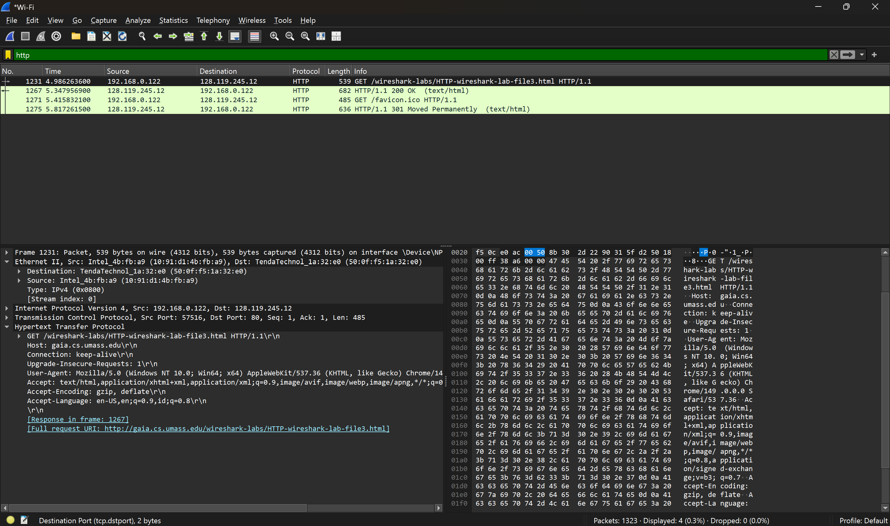
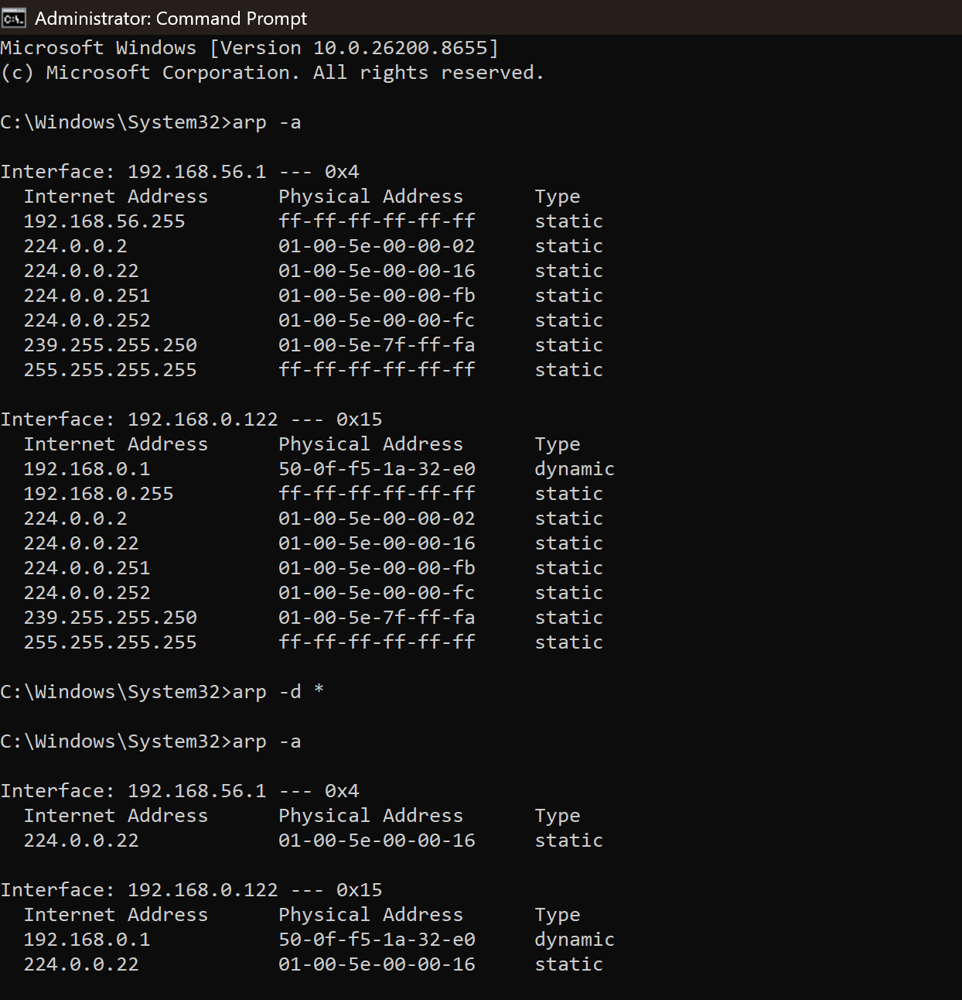
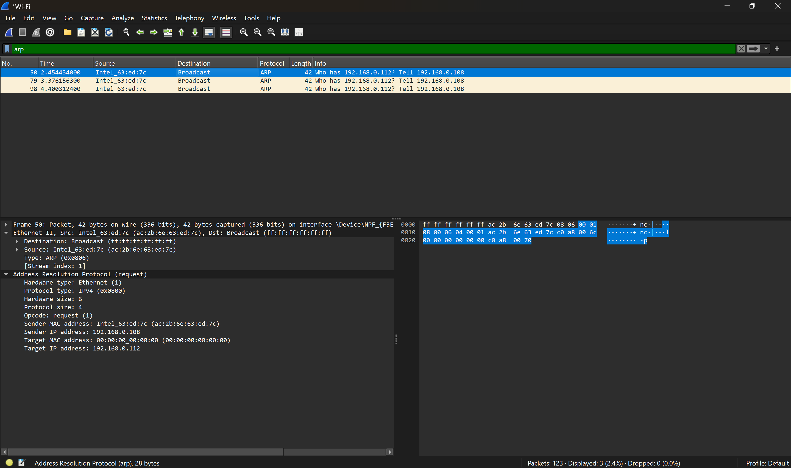

# Laporan Praktikum Modul 13: Ethernet dan ARP

## Tujuan

1. Mampu menginvestigasi cara kerja Ethernet dan ARP menggunakan Wireshark

## Menangkap dan Menganalisis Frame Ethernet

1. Pertama, pastikan cache browser Anda kosong. Untuk melakukan hal ini pada Mozilla
   Firefox V3, pilih Tools -> Clear Recent History dan centang kotak untuk Cache. Untuk
   Internet Explorer, pilih Tools -> Internet Options -> Delete Files. Mulai sniffer paket
   Wireshark.
2. Masukkan URL berikut ke dalam browser Anda
   http://gaia.cs.umass.edu/wireshark-labs/HTTP-ethereal-lab-file3.html
3. Hentikan penangkapan paket Wireshark. Pertama, temukan nomor paket (kolom paling kiri
   pada window Wireshark bagian atas) dari pesan HTTP GET yang dikirim dari komputer Anda
   ke gaia.cs.umass.edu, serta awal dari pesan HTTP yang dikirim ke komputer Anda oleh
   gaia.cs.umass.edu. Anda akan melihat layar yang terlihat seperti ini (di mana paket 4 pada
   gambar di bawah ini berisi pesan HTTP GET)

Hasil Pengamatan:

- Source MAC Address: `Intel_4b:fb:a9 (10:91:d1:4b:fb:a9)`
- Destination MAC Address: `TendaTEchnol_1a:32:e0 (50:0f:f5:1a:32:e0)`
- Type: 0x0800

## Address Resolution Protocol (ARP)

### Mengamati dan Memanipulasi ARP Cache

1. Buka Command Prompt as Administrator
2. Ketik perintah `arp -a` untuk melihat dan menampilkan seluruh isi tabel ARP cache yang saat ini sedang tersimpan pada memori komputer
3. Untuk memastikan kita dapat mengamati proses pengiriman pesan ARP baru, kosongkan ARP cache dengan perintah: `arp -d *`
4. Periksa dengan kembali memberikan perintah `arp -a` agar dapat memastikan bahwa seluruh entri tabel ARP yang bersifat dinamis (dynamic) telah berhasil dihapus dan dibersihkan dari sistem

### Mengamati Aksi Protokol ARP

1. Setelah ARP cache dikosongkan, bersihkan kembali cache browser Anda.
2. Jalankan kembali proses capture paket pada Wireshark.
3. Akses kembali URL: http://gaia.cs.umass.edu/wireshark-labs/HTTP-wireshark-lab-file3.html melalui browser.
4. Hentikan penangkapan paket pada Wireshark.
5. Gunakan filter pada Wireshark dengan mengetik `arp` untuk fokus mengamati paket ARP.
   

Hasil Pengamatan:

- Opcode: request (1). Artinya: Paket ini adalah ARP Request (laptop sedang bertanya, bukan menjawab).
- Sender IP address: 192.168.0.108. Artinya: IP Address laptop Anda yang mengirimkan pertanyaan.
- Target IP address: 192.168.0.112. Artinya: IP Address perangkat yang sedang dicari alamat MAC-nya.
- Target MAC address: 00:00:00:00:00:00. Artinya: Nilainya kosong (nol) karena MAC Address target memang belum diketahui dan baru dicari.

## Kesimpulan

Praktikum ini membuktikan bahwa protokol Ethernet dan ARP bekerja bersama dalam mengatur komunikasi data di jaringan lokal. Ethernet bertugas mengirimkan data antarperangkat menggunakan alamat fisik (MAC Address), di mana paket yang menuju internet akan diarahkan ke MAC Address milik Router (Gateway) terlebih dahulu. Sementara itu, ARP berfungsi menerjemahkan IP Address menjadi MAC Address tujuan. Ketika ARP Cache dikosongkan, komputer akan mengirimkan pesan ARP Request secara Broadcast ke seluruh jaringan untuk mencari dan mendata ulang MAC Address perangkat yang ingin dituju agar koneksi tetap berjalan.
