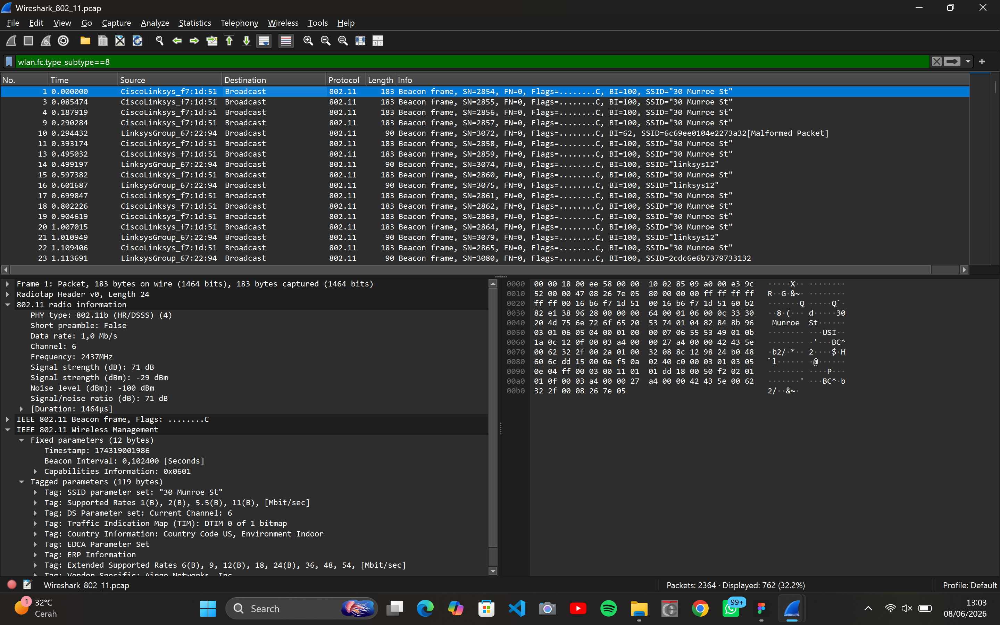
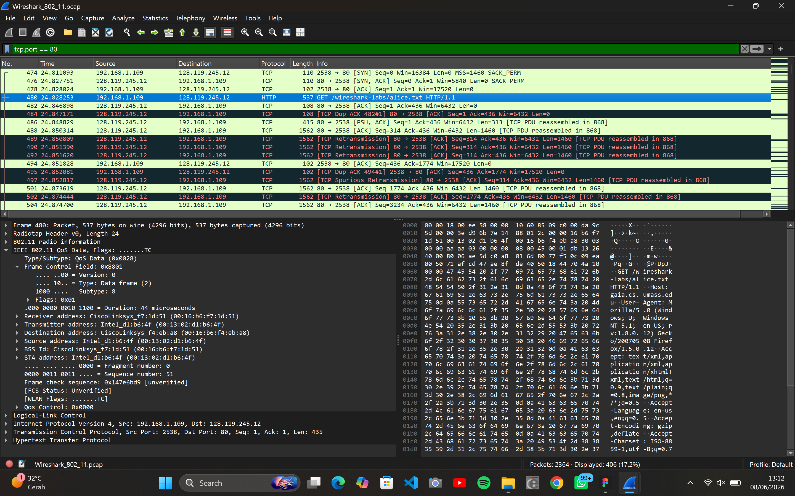
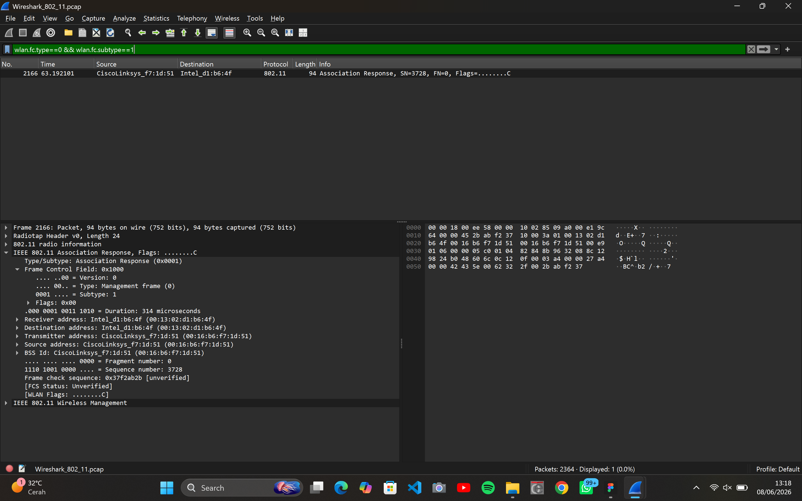
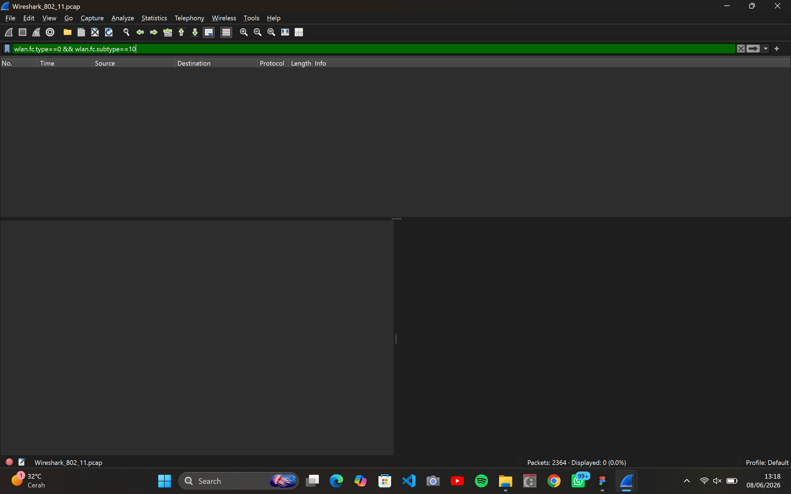

# Laporan Praktikum Modul 14: 802.11 WiFi

## Tujuan

1. Mampu menginvestigasi cara kerja WiFi menggunakan Wireshark

## Starting

1. Unduh berkas jejak (Trace File): Unduh berkas kompresi .zip melalui http://gaia.cs.umass.edu/wireshark-labs/wireshark-traces.zip.
2. Ekstrak file zip tersebut untuk mendapatkan berkas pelacakan target yang bernama Wireshark_802_11.pcap. Berkas jejak ini sebelumnya dikumpulkan menggunakan perangkat AirPcap dan Wireshark pada jaringan rumah penulis modul yang terdiri dari sebuah titik akses/router gabungan Linksys 802.11g, dua PC berkabel, dan satu PC host nirkabel. Seluruh aktivitas nirkabel tersebut ditangkap di Saluran 6 (Channel 6).
3. Buka file tersebut di Wireshark. Tampilan awal setelah berkas berhasil dimuat akan menyajikan daftar seluruh paket nirkabel yang tertangkap.
   [gambar1](../assets/image/modul14_1.png)

## Beacon Frames

Beacon Frame (bingkai suar) digunakan oleh 802.11 AP (Access Point) untuk mengiklankan keberadaannya kepada perangkat di sekitarnya. Untuk menyaring dan melihat detail Beacon Frame, diterapkan display filter pada Wireshark: `wlan.fc.type_subtype == 8`

Hasil Analisis:

- Informasi AP Utama: Terdeteksi Access Point (AP) aktif dari vendor CiscoLinksys(CiscoLinksys_f7:1d:51) yang menyiarkan jaringan dengan nama SSID: "30 Munroe St"
- Karakteristik Fisik: AP ini secara konsisten memancarkan sinyal suar (beacon) setiap 102 milidetik(Beacon Interval: 0,102400) menggunakan Saluran 6 (Frekuensi 2437 MHz)
- Posisi Perangkat: Kekuatan sinyal yang ditangkap sangat kuat, yaitu -29 dBm, menandakan bahwa PC host berada sangat dekat dengan pemancar AP

## Data Transfer

Pada tahap ini, dianalisis proses transfer data melalui asosiasi 802.11 ketika host membuat permintaan HTTP. Berikan filter `tcp.port == 80` untuk mengisolasi lalu lintas web (HTTP).

Hasil Analisis:

- Pada waktu t = 24.828253 detik, terjadi aktivitas transfer data penting pada Frame 480. Aktivitas ini berupa permintaan HTTP GET dari host lokal ber-IP 192.168.1.109 menuju web server luar dengan IP 128.119.245.12 (gaia.cs.umass.edu)
- Tujuan Paket: Host nirkabel sedang melakukan request untuk mengunduh dokumen teks bernama /wireshark-labs/alice.txt dengan total ukuran paket 537 bytes
- Analisis Lapisan 802.11: Paket ini dikategorikan sebagai IEEE 802.11 QoS Data (Data Frame), dikirim oleh asal perangkat (Source Address) Intel_d1:b6:4f dan diteruskan melalui alamat gateway AP (Transmitter/BSSID) CiscoLinksys_f7:1d:51

## Association/Disassociation

Asosiasi dilakukan menggunakan bingkai ASSOCIATE REQUEST (tipe 0, subtipe 10) dari host ke AP, dan bingkai ASSOCIATE RESPONSE (tipe 0, subtipe 1) dari AP ke host.

1. Pemeriksaan Associate Response:

- Filter: wlan.fc.type == 0 && wlan.fc.subtype == 1
  
- Terdeteksi 1 paket sukses pada detik ke 63.192101. Paket ini dikirim oleh AP CiscoLinksys menuju perangkat client Intel (Intel_d1:b6:4f). Aktivitas ini merupakan respons persetujuan dari AP untuk menerima kembali perangkat client yang sempat melakukan pemutusan/asosiasi ulang di akhir sesi pelacakan.

2. Pemeriksaan Associate Request:

- Filter: wlan.fc.type == 0 && wlan.fc.subtype == 10
  
- Hasil pencarian filter bernilai kosong (0 paket). Analisisnya menunjukkan bahwa perangkat client sudah berada dalam kondisi terhubung (authenticated & associated) sejak awal perekaman dimulai, sehingga tidak ada inisiasi permintaan gabung baru dari arah pengguna.

## Kesimpulan

Berdasarkan hasil analisis berkas pelacakan nirkabel menggunakan Wireshark, dapat disimpulkan bahwa komunikasi jaringan WiFi (IEEE 802.11) berjalan melalui tiga aktivitas utama yang saling mendukung. Pertama, Access Point(AP) "30 Munroe St" secara konsisten mengumumkan keberadaannya di Saluran 6 dengan memancarkan Beacon Frame setiap 102 milidetik pada kekuatan sinyal yang sangat kuat (-29 dBm). Kedua, aktivitas transfer data riil terdeteksi jelas pada Frame 480 saat perangkat client mengirimkan permintaan data (QoS Data) berupa HTTP GET untuk mengunduh file teks dari server luar. Terakhir, untuk manajemen koneksi, perangkat diketahui sudah terhubung sejak awal perekaman sehingga tidak memicu Associate Request, tetapi sempat melakukan proses asosiasi ulang yang dibuktikan dengan adanya satu paket Associate Response sukses dari AP pada detik ke-63.
