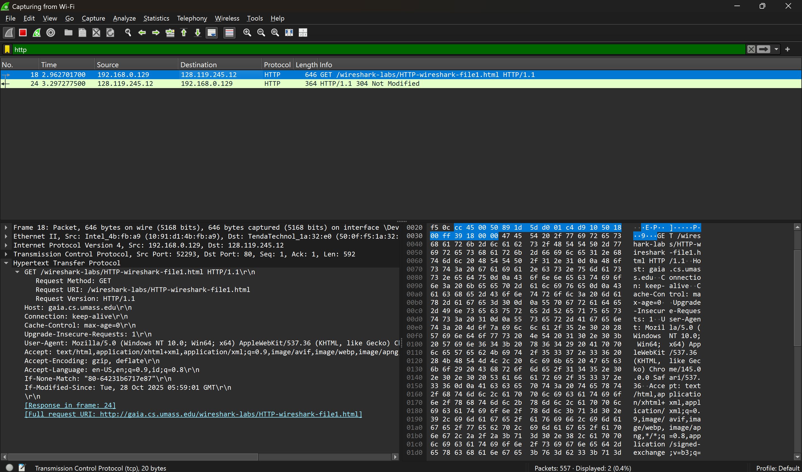
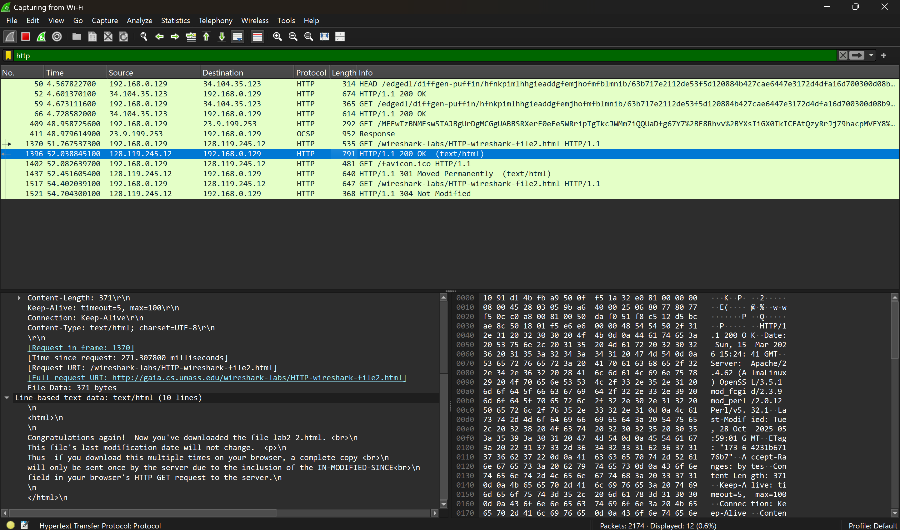
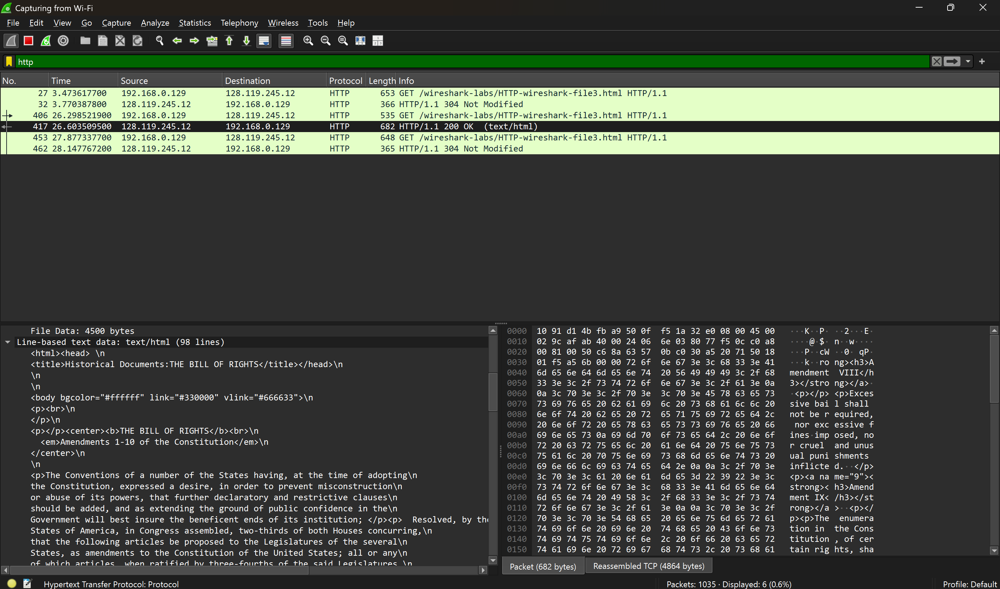
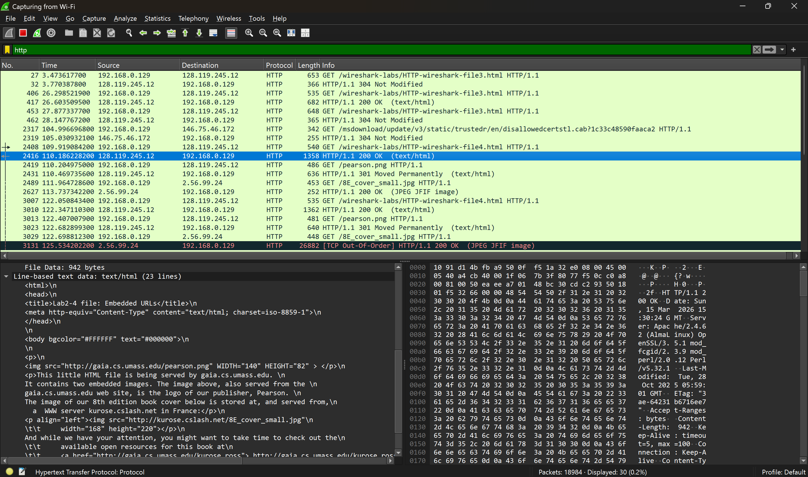
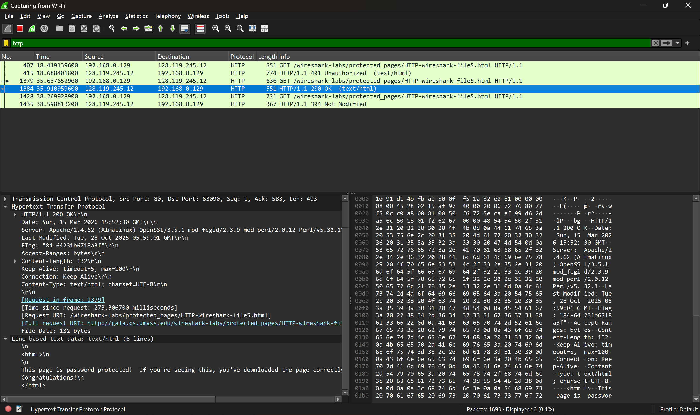
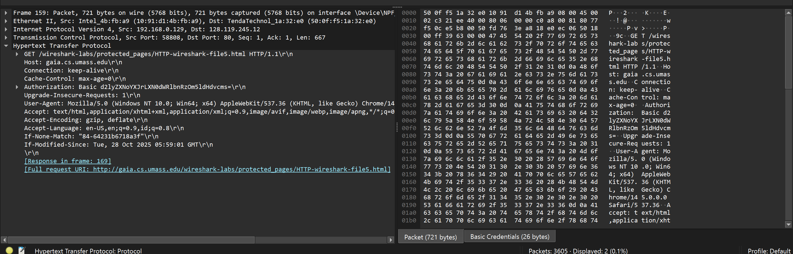

# Laporan Praktikum Modul 3: HTTP

## Tujuan Praktikum

1. Menginvestigasi cara kerja protokol HTTP menggunakan Wireshark

## Pendahuluan

HTTP adalah singkatan dari Hypertext Transfer Protocol. HTTP merupakan protokol komunikasi yang digunakan untuk mentransfer data di internet, khususnya data dari server web ke browser pengguna. Dalam istilah sederhana, HTTP memungkinkan browser untuk mengakses, menampilkan, dan mengirimkan data dari satu titik ke titik lainnya melalui internet. Saat pengguna memasukkan alamat situs web, browser mengirimkan permintaan ke server, lalu server merespon dengan mengirimkan data yang dibutuhkan.

## 1. Interaksi Dasar GET/Response

Pada percobaan ini, dilakukan pengambilan file HTML sederhana.

1. Buka web browser
2. Jalankan Wireshark, mulai pengambilan paket (capture)
3. Masukkan URL berikut: http://gaia.cs.umass.edu/wireshark-labs/HTTP-wireshark-file1.html
4. Masukkan “http” di jendela spesifikasi filter tampilan, sehingga hanya pesan HTTP yang diambil yang akan ditampilkan nanti di jendela daftar paket
   

## 2. HTTP Conditional GET (Catching)

Browser memiliki mekanisme caching untuk menyimpan objek yang pernah diunduh sebelumnya. Untuk menghemat bandwidth, browser dapat melakukan Conditional GET menggunakan header If-Modified-Since.

1. Buka web browser. Pastikan cache browser sudah dibersihkan
2. Mulai pengambilan paket (capture) baru
3. Masukkan URL berikut: http://gaia.cs.umass.edu/wireshark-labs/HTTP-wireshark-file2.html
4. Hentikan pengambilan paket Wireshark, dan masukkan “http” di jendela spesifikasi filter tampilan, sehingga hanya pesan HTTP yang diambil yang akan ditampilkan nanti di jendela daftar paket
   

## 3. Retrieving Long Documents (Pengambilan Dokumen Panjang)

Ketika meminta file yang besar, satu pesan HTTP respons mungkin tidak cukup dimuat dalam satu segmen TCP tunggal. Dalam Wireshark, satu respons HTTP dapat dipecah menjadi beberapa segmen TCP. Wireshark akan menunjukkan keterangan "TCP segment of a reassembled PDU" untuk menunjukkan bahwa data tersebut merupakan bagian dari satu kesatuan data HTTP yang besar.

1. Bersihkan cache browser dan mulai capture
2. Masukkan URL berikut: http://gaia.cs.umass.edu/wireshark-labs/HTTP-wireshark-file3.html
3. Hentikan pengambilan paket Wireshark, dan masukkan “http” di jendela tampilan-filterspesifikasi, sehingga hanya pesan HTTP yang diambil yang akan ditampilkan
   

## 4. HTML dengan Embedded Objects (Objek Tersemat)

Saat mengunduh file HTML, browser akan memindai isinya. Jika ditemukan referensi ke objek eksternal (seperti gambar atau ikon), browser secara otomatis mengirimkan permintaan HTTP GET tambahan untuk setiap objek tersebut.

1. Bersihkan cache browser dan mulai pengambilan paket
2. Masukkan URL berikut: http://gaia.cs.umass.edu/wireshark-labs/HTTP-wireshark-file4.html
3. Hentikan pengambilan paket Wireshark, dan masukkan “http” di jendela tampilan-filterspesifikasi, sehingga hanya pesan HTTP yang diambil yang akan ditampilkan
4. Browser akan mengirimkan beberapa pesan GET: satu untuk file HTML utama, dan sisanya untuk file gambar yang ada di dalam halaman tersebut.
   

## 5. HTTP Authentication (Otentikasi)

Beberapa halaman web menggunakan Basic Authentication untuk membatasi akses. Kredensial(username dan password) dikirim hanya dengan kode Base64. Karena Base64 bukan enkripsi rahasia, siapa pun yang mengintip jaringan / menggunakan Wireshark bisa membaca data tersebut dengan mudah.

1. Bersihkan cache browser dan mulai pengambilan paket (capture).
2. Masukkan URL berikut: http://gaia.cs.umass.edu/wireshark-labs/protected_pages/HTTP-wireshark-file5.html
3. Saat pop-up muncul, masukkan username dan password:

- username: wireshark-students
- password: network

4. Hentikan pengambilan paket Wireshark, dan masukkan “http” di jendela tampilan-filterspesifikasi, sehingga hanya pesan HTTP yang diambil yang akan ditampilkan
   
   

## Kesimpulan

Praktikum ini menunjukkan bahwa saat kita membuka situs web, browser bekerja keras berkomunikasi dengan server untuk mengambil data. Catching membantu browser tidak perlu mengunduh ulang gambar atau teks yang sama agar internet lebih cepat. Melalui ptaktikum ini juga dapat dilihat bahwa file besar (seperti dokumen panjang) harus dipecah-pecah terlebih dahulu agar bisa terkirim dengan sempurna tanpa error. Terakhir, menyadari bahwa fitur login pada situs web biasa (HTTP) ternyata tidak aman. Username dan password tidak benar-benar dikunci, melainkan hanya disamarkan, sehingga siapa pun yang bisa melihat jaringan kita akan dengan mudah membaca data pribadi tersebut.
