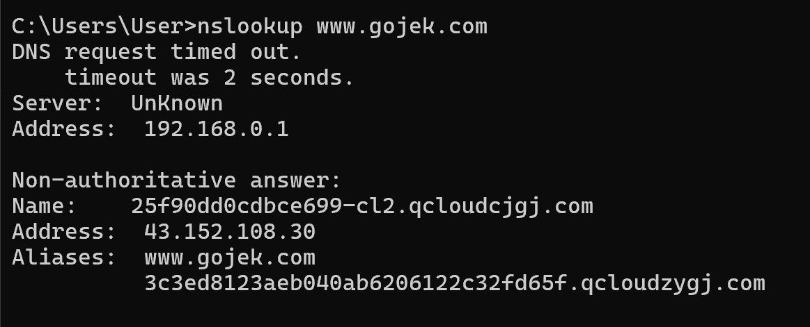
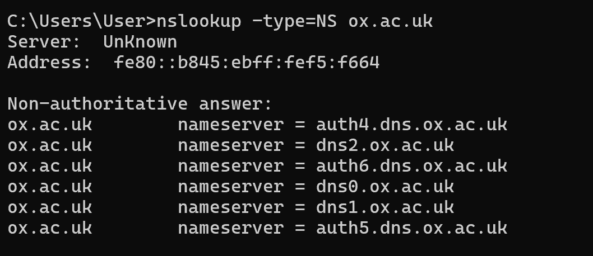
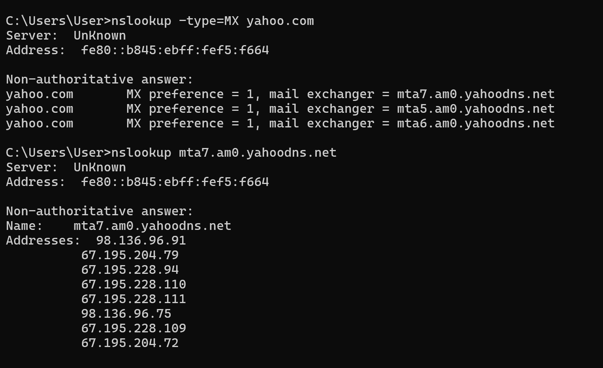
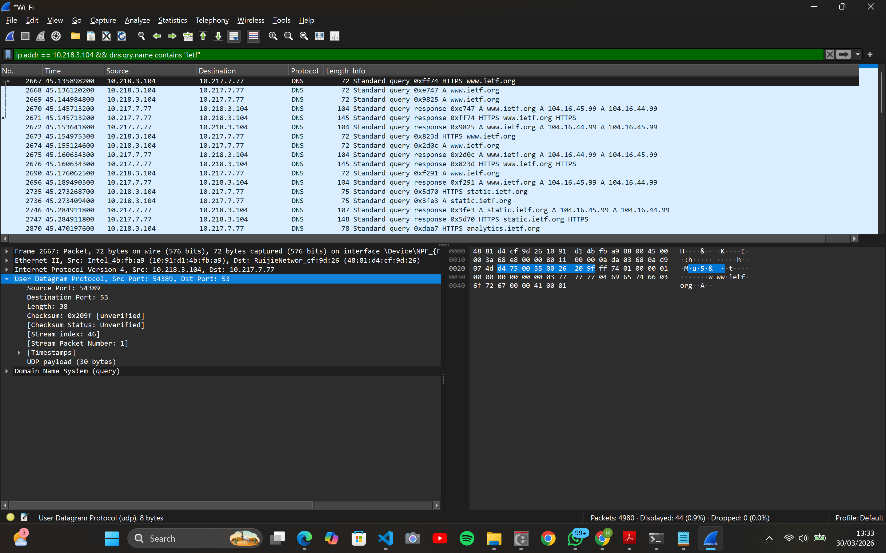
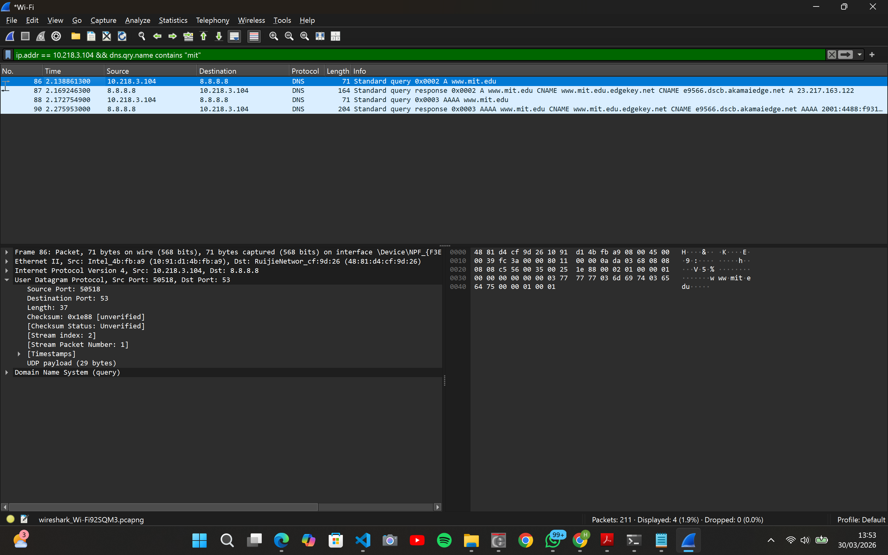
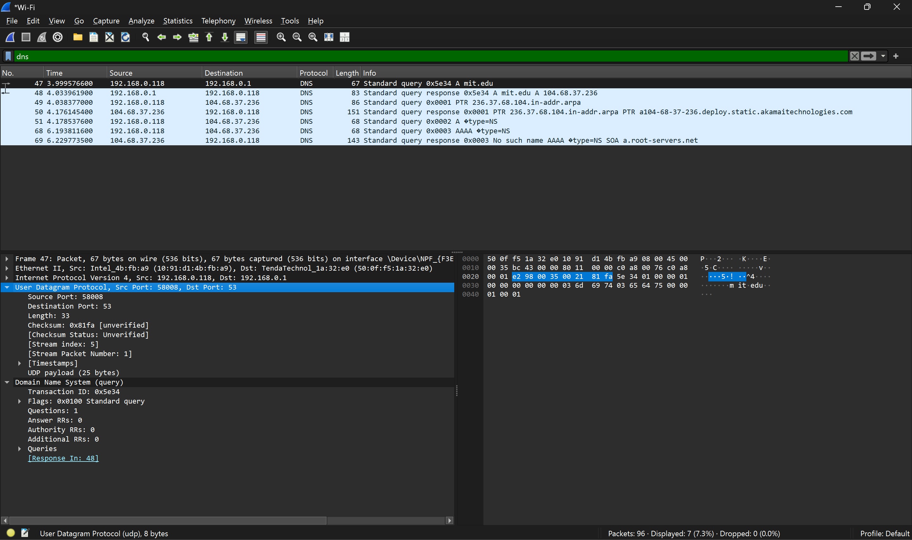
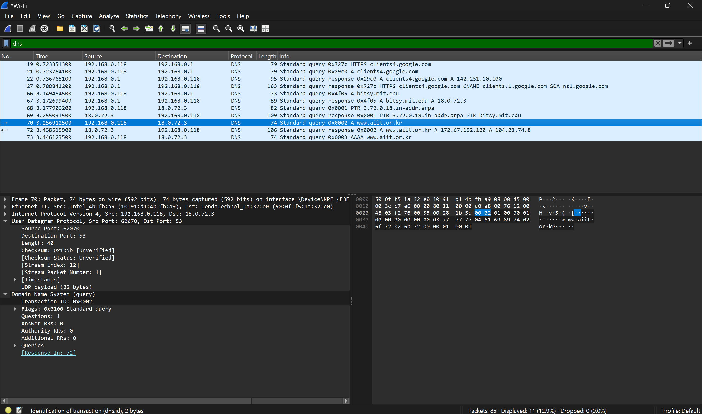

# Laporan Praktikum Modul 4: DNS

## Tujuan Praktikum

1. Mampu menginvestigasi cara kerja DNS menggunakan Wireshark

## Nslookup

1. Jalankan nslookup untuk mendapatkan alamat IP dari server web di Asia. Berapa alamat IP
   server tersebut?
   
   Berdasarkan hasil perintah **nslookup www.gojek.com**, dapat dilihat bahwa alamat IP server tersebut ialah 43.152.108.30
2. Jalankan nslookup agar dapat mengetahui server DNS otoritatif untuk universitas di Eropa.
   
   Untuk mengetahui nama host dari DNS otoritatif suatu server (pada contoh ini menggunakan ox.ac.uk), kita dapat menggunakan perintah **nslookup -type=NS ox.ac.uk**.
    
   Dari gambar di atas, dapat dilihat daftar server DNS Otoratatif untuk website Oxford.

3. Jalankan nslookup untuk mencari tahu informasi mengenai server email dari Yahoo! Mail melalui salah satu server yang didapatkan di pertanyaan nomor 2. Apa alamat IP-nya?
   
   Berdasarkan hasil perintah **nslookup -type=MX yahoo.com**, dapat dilihat bahwa Yahoo memiliki beberapa Mail Exchanger.
    
   Untuk melihat alamat IP-nya, diberikan perintah **nslookup mta7.am0.yahoodns.net** untuk melihat salah satu mail exchangernya.

## Tracing DNS dengan Wireshark I

1. Cari pesan permintaan DNS dan balasannya. Apakah pesan tersebut dikirimkan melalui UDP
   atau TCP?
   - Berdasarkan hasil percobaan pada Wireshark, pesan tersebut dikirimkan melalui UDP.
2. Apa port tujuan pada pesan permintaan DNS? Apa port sumber pada pesan balasannya?
   - Port tujuan (Destination Port): 53
   - Port sumber (Source Port): 54389
3. Pada pesan permintaan DNS, apa alamat IP tujuannya? Apa alamat IP server DNS lokal anda
   (gunakan ipconfig untuk mencari tahu)? Apakah kedua alamat IP tersebut sama?
   - Pada pesan permintaan DNS, alamat IP tujuan: 10.217.7.77
   - Kedua alamat IP tersebut sama
4. Periksa pesan permintaan DNS. Apa “jenis” atau ”type” dari pesan tersebut? Apakah pesan
   permintaan tersebut mengandung ”jawaban” atau ”answers”?
   - Jenis (Type): Jenis pesan tersebut adalah Type A (untuk mencari alamat IPv4)
   - Pesan permintaan tidak mengandung jawaban
5. Periksa pesan balasan DNS. Berapa banyak ”jawaban” atau ”answers” yang terdapat di
   dalamnya? Apa saja isi yang terkandung dalam setiap jawaban tersebut?
   - Jumlah Jawaban: Pada paket 2670, terdapat 2 jawaban (terlihat dari info: A 104.16.45.99 A 104.16.44.99)
   - Isi Jawaban: Isinya adalah nama domain (www.ietf.org), tipe record (A), dan alamat IP yang dicari (contoh: 104.16.45.99 dan 104.16.44.99)
6. Perhatikan paket TCP SYN yang selanjutnya dikirimkan oleh host Anda. Apakah alamat IP
   pada paket tersebut sesuai dengan alamat IP yang tertera pada pesan balasan DNS?
   - Ya, alamat IP pada paket TCP SYN selanjutnya yang digunakan untuk koneksi HTTP/HTTPS akan sesuai dengan salah satu alamat IP yang diberikan dalam balasan DNS tersebut.
7. Halaman web yang sebelumnya anda akses (http://www.ietf.org) memuat beberapa
   gambar. Apakah host Anda perlu mengirimkan pesan permintaan DNS baru setiap kali ingin
   mengakses suatu gambar?
   - Tidak. Ketika gambar berada di bawah domain yang sama (www.ietf.org), tidak perlu mengirim pesan permintaan lagi karena host sudah memiliki alamat IP-nya di dalam DNS Cache.

## Tracing DNS dengan Wireshark II

1. Apa port tujuan pada pesan permintaan DNS? Apa port sumber pada pesan balasan DNS?

- Port tujuan pada pesan permintaan: 53
- Port sumber pada pesan balasan: 53

2. Ke alamat IP manakah pesan permintaan DNS dikirimkan? Apakah alamat IP tersebut
   merupakan default alamat IP server DNS lokal Anda?

- Alamat IP Tujuan: Pesan permintaan dikirimkan ke alamat IP 10.218.3.104
- Ya, alamat IP tersebut merupakan default alamat IP server DNS lokal.

3. Periksa pesan permintaan DNS. Apa ”jenis” atau ”type” dari pesan tersebut? Apakah pesan
   tersebut mengandung ”jawaban” atau ”answers”?

- Type: A, digunakan untuk domain ke alamat IPv4
- Tidak mengandung jawaban

4. Periksa pesan balasan DNS. Berapa banyak ”jawaban” atau “answers” yang terdapat di
   dalamnya. Apa saja isi yang terkandung dalam setiap jawaban tersebut?
   - Jumlah Jawaban: Terdapat 3 jawaban
   - Isi Jawaban: CNAME (Canonical Name): Mengarahkan www.mit.edu ke www.mit.edu.edgekey.net., CNAME: Mengarahkan kembali ke e9566.dscb.akamaiedge.net., Address (A): Memberikan alamat IP akhir yaitu 23.217.163.122.

## Tracing DNS dengan Wireshark III

1. Ke alamat IP manakah pesan permintaan DNS dikirimkan? Apakah alamat IP tersebut
   merupakan default alamat IP server DNS lokal Anda?
   - IP Tujuan: 192.168.0.1
   - Ya, ini adalah default alamat IP server DNS lokal Anda.
2. Periksa pesan permintaan DNS. Apa ”jenis” atau ”type” dari pesan tersebut? Apakah pesan
   tersebut mengandung ”jawaban” atau ”answers”?
   - Jenis (Type): Jenis pesan tersebut adalah Type A
   - Jawaban (Answers): Tidak mengandung jawaban
3. Periksa pesan balasan DNS. Apa nama server MIT yang diberikan oleh pesan balasan?
   Apakah pesan balasan ini juga memberikan alamat IP untuk server MIT tersebut?
   - Nama Server MIT: Nama server yang dicari adalah mit.edu.
   - Alamat IP Server MIT: Ya, pesan balasan memberikan alamat IP. A mit.edu A 104.68.37.236.

## Tracing DNS dengan Wireshark IV

1. Ke alamat IP manakah pesan permintaan DNS dikirimkan? Apakah alamat IP tersebut
   merupakan default alamat IP server DNS lokal Anda?
   - IP Tujuan: 18.0.72.3
   - Status DNS Lokal: Bukan. Berdasarkan riwayat paket sebelumnya (nomor 19, 21), DNS lokal Anda adalah 192.168.0.1. Alamat 18.0.72.3 adalah server DNS eksternal milik MIT (bitsy.mit.edu).

2. Periksa pesan permintaan DNS. Apa ”jenis” atau ”type” dari pesan tersebut? Apakah pesan
   tersebut mengandung ”jawaban” atau ”answers”?
   - Jenis (Type): Jenis pesan tersebut adalah Type A.
   - Tidak mengandung jawaban

3. Periksa pesan balasan DNS. Berapa banyak ”jawaban” atau “answers” yang terdapat di
   dalamnya. Apa saja isi yang terkandung dalam setiap jawaban tersebut?
   - Jumlah Jawaban: Terdapat 2 jawaban. Terlihat pada kolom Info: A 172.67.152.120 A 104.21.74.8.
   - Isi Jawaban: Isi dari jawaban tersebut mencakup:
      
     Nama Domain: www.aiit.or.kr
      
     Tipe Record: A (Host Address)
      
     Alamat IP 1: 172.67.152.120
      
     Alamat IP 2: 104.21.74.8

## Kesimpulan

Praktikum ini membuktikan bahwa DNS bekerja di atas protokol UDP port 53 untuk menerjemahkan nama domain menjadi alamat IP secara cepat. Melalui analisis Wireshark, terlihat bahwa pesan query hanya berisi pertanyaan, sementara pesan response menyediakan jawaban berupa Record A (IP) atau CNAME (alias). Selain itu, penggunaan server DNS bisa bervariasi antara server lokal (gateway) maupun server eksternal/otoritatif. Terakhir, efisiensi jaringan terjaga karena adanya mekanisme DNS Caching, sehingga perangkat tidak perlu melakukan kueri ulang untuk domain yang sama dalam satu sesi akses.
