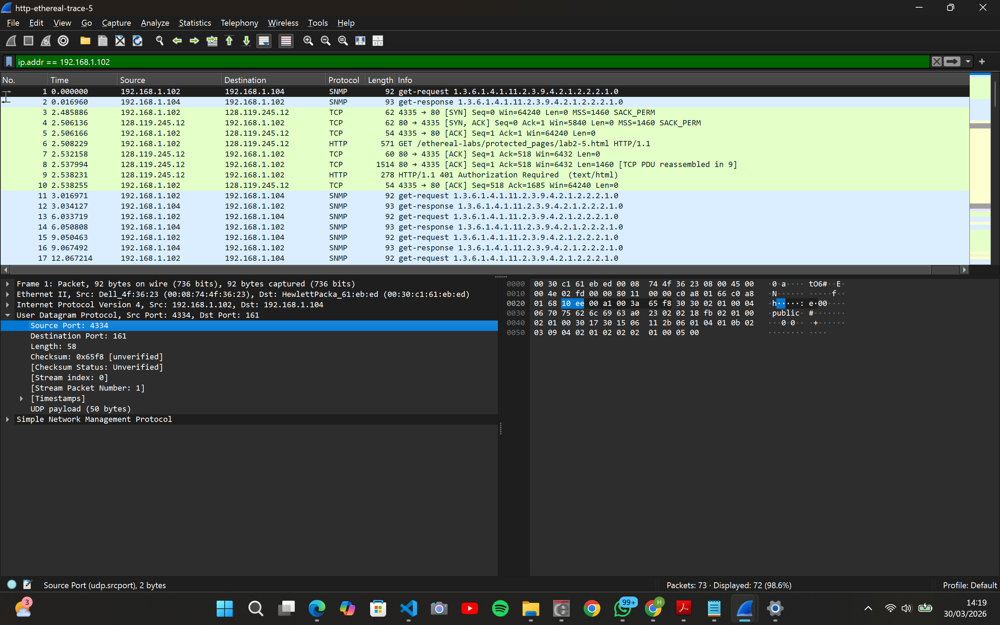

# Laporan Praktikum Modul 5: UDP

## Tujuan Praktikum

1. Mampu menginvestigasi cara kerja protokol UDP menggunakan Wireshark

#

Pada modul ini, saya akan menggunakan file http-ethereal-trace-5 dari folder wireshark yang sudah disediakan.

1. Pilih satu paket UDP yang terdapat pada trace Anda. Dari paket tersebut, berapa banyak
   “field” yang terdapat pada header UDP? Sebutkan nama-nama field yang Anda temukan! - Ada 4 field utama dalam header UDP, yaitu:
   - Source Port: 4334, port asal
   - Destination Port: 161, port tujuan
   - Length: 58, total panjang paket
   - Checksum, untuk verifikasi integritas data

2. Perhatikan informasi “content field” pada paket yang Anda pilih di pertanyaan 1. Berapa
   panjang (dalam satuan byte) masing-masing “field” yang terdapat pada header UDP?
   - Source Port: 2 byte
   - Destination Port: 2 byte
   - Length: 2 byte
   - Checksum: 2 byte
   - Total Header UDP: 8 byte.
3. Nilai yang tertera pada ”Length” menyatakan nilai apa? Verfikasi jawaban Anda melalui paket UDP pada trace.
   - Nilai pada field Length menyatakan panjang total dari Header UDP + Payload (Data) dalam satuan byte.

4. Berapa jumlah maksimum byte yang dapat disertakan dalam payload UDP? (Petunjuk: jawaban untuk pertanyaan ini dapat ditentukan dari jawaban Anda untuk pertanyaan 2)
   - Karena field Length terdiri dari 16 bit, nilai maksimum yang bisa ditampung adalah $2^{16} - 1 = 65.535$ byte. Namun, karena nilai tersebut mencakup header (8 byte), maka jumlah maksimum payload adalah: 65.535 - 8 = 65.527 byte

5. Berapa nomor port terbesar yang dapat menjadi port sumber? (Petunjuk: lihat petunjuk pada pertanyaan 4)
   - Nomor port menggunakan field sebesar 16 bit. Maka, nomor port terbesar yang dimungkinkan adalah 65.535

6. Berapa nomor protokol untuk UDP? Berikan jawaban Anda dalam notasi heksadesimal dan desimal. Untuk menjawab pertanyaan ini, Anda harus melihat ke bagian ”Protocol” pada datagram IP yang mengandung segmen UDP.
   - Desimal: 17
   - Heksadesimal: 0x11
7. Periksa pasangan paket UDP di mana host Anda mengirimkan paket UDP pertama dan paket UDP kedua merupakan balasan dari paket UDP yang pertama. (Petunjuk: agar paket kedua merupakan balasan dari paket pertama, pengirim paket pertama harus menjadi tujuan daripaket kedua). Jelaskan hubungan antara nomor port pada kedua paket tersebut!
   - Paket 1 (Request): Source Port = 4334, Destination Port = 161.
   - Paket 2 (Response): Source Port = 161, Destination Port = 4334.
   - Hubungannya adalah berkebalikan (inverted). Source port pada paket pertama menjadi destination port pada paket balasan, dan destination port pada paket pertama menjadi source port pada paket balasan.

## Kesimpulan

Dari praktikum ini, kita bisa melihat bahwa UDP adalah protokol yang sangat sederhana karena hanya punya 4 bagian utama di header-nya dengan ukuran total yang kecil, yaitu 8 byte saja. Lewat analisis di Wireshark, terbukti bahwa angka Length di UDP itu adalah gabungan dari ukuran header dan isi datanya (payload). Kita juga bisa melihat cara kerja komunikasinya: saat ada balasan, nomor port asal dan tujuan tinggal ditukar saja. Terakhir, UDP punya tanda pengenal unik di jaringan berupa nomor protokol 17 yang membuatnya mudah dikenali oleh sistem.
