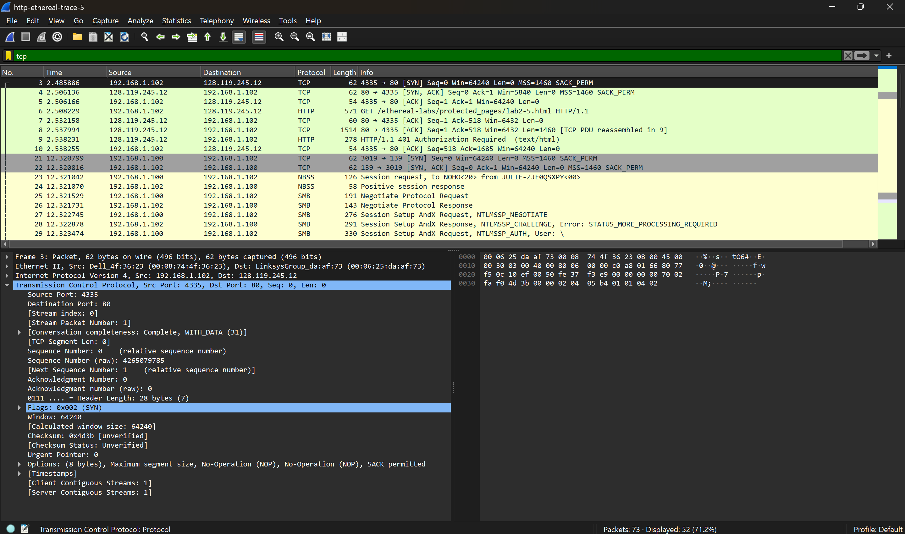
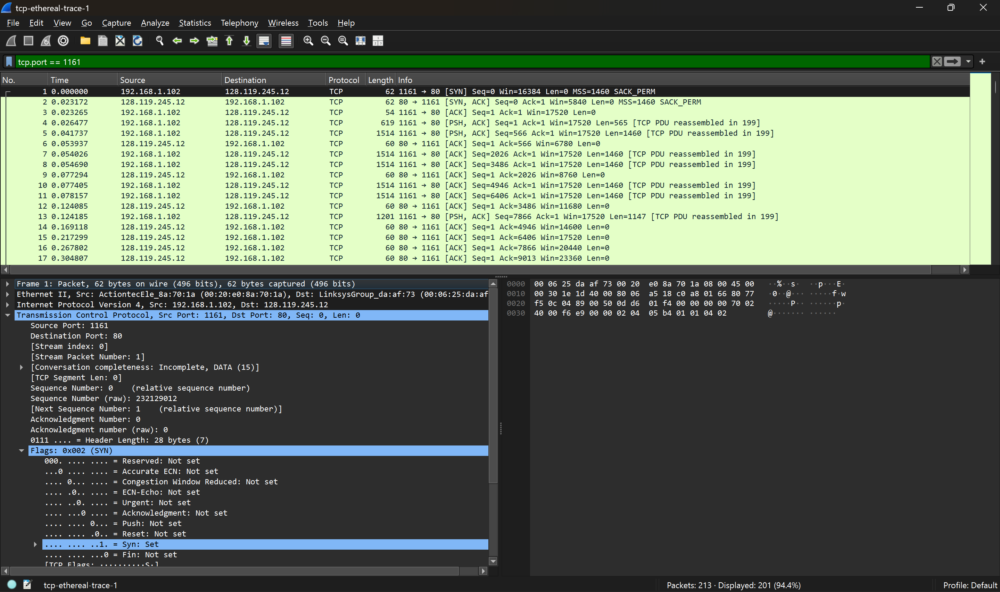
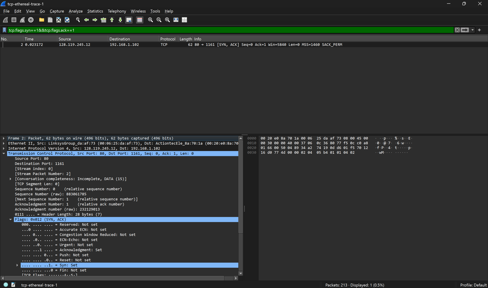
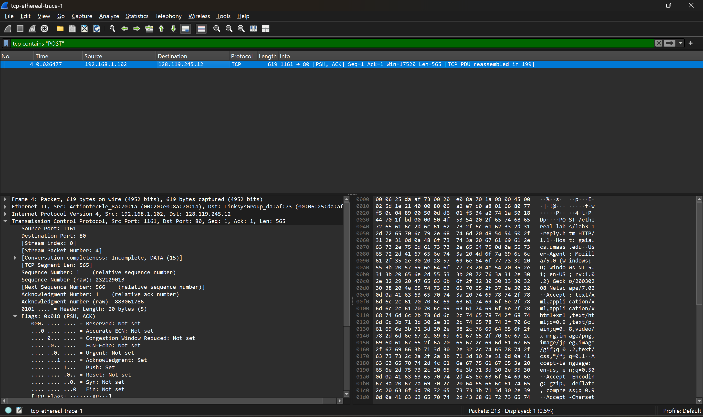
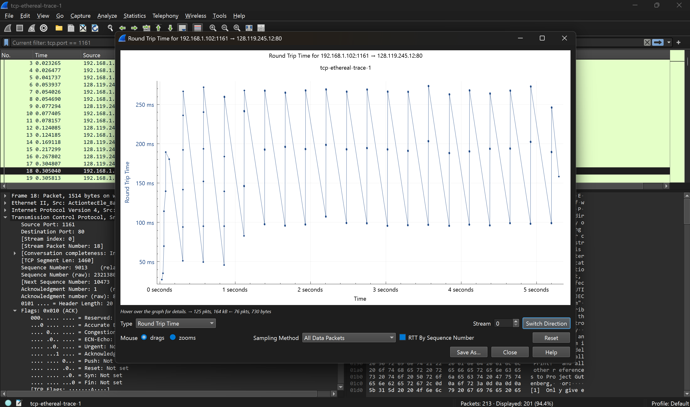
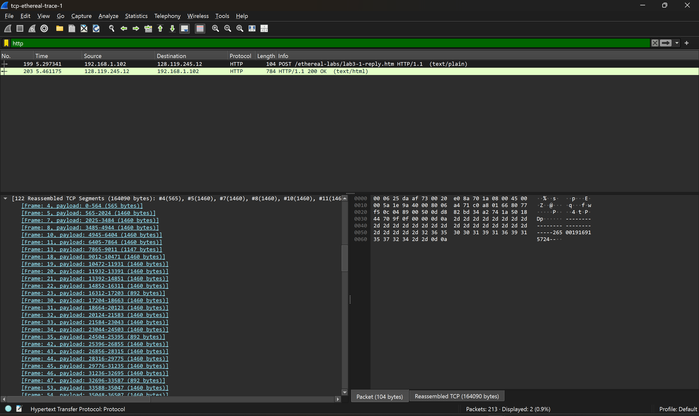
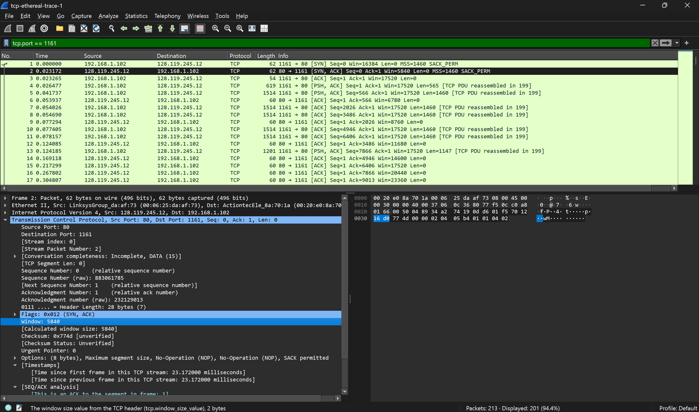
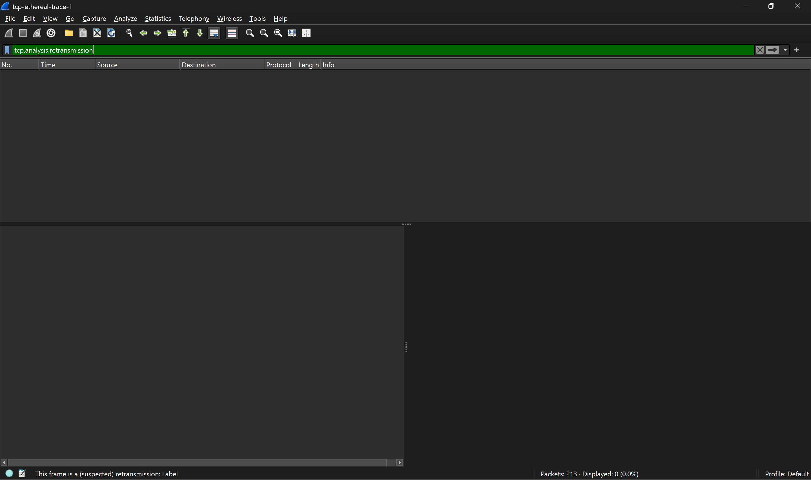
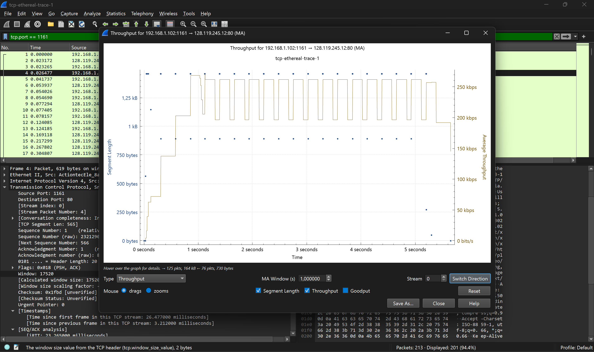

# Laporan Praktikum Modul 6: TCP

## Tujuan

1. Mampu menginvestigasi cara kerja protokol TCP menggunakan Wireshark

## Menangkap Tansfer TCP dalam Jumlah Besar dari Komputer Pribadi ke Remote Server

1. Jalankan browser web Anda. Buka http://gaia.cs.umass.edu/wireshark-labs/alice.txt dan
   unduh salinan ASCII dari naskah Alice in Wonderland. Simpan file tersebut di komputer
   Anda.
2. Selanjutnya buka http://gaia.cs.umass.edu/wireshark-labs/TCP-wireshark-file1.html .

1. Berapa alamat IP dan nomor port TCP yang digunakan oleh komputer klien (sumber) untuk
   mentransfer file ke gaia.cs.umass.edu? Cara paling mudah menjawab pertanyaan ini adalah
   dengan memilih sebuah pesan HTTP dan meneliti detail paket TCP yang digunakan untuk
   membawa pesan HTTP tersebut.
   - Alamat IP Klien: 192.168.1.102
   - Nomor Port TCP: 4335
2. Apa alamat IP dari gaia.cs.umass.edu? Pada nomor port berapa ia mengirim dan menerima
   segmen TCP untuk koneksi ini?
   - Alamat IP Server: 128.119.245.12
   - Nomor Port TCP: 80
3. Berapa alamat IP dan nomor port TCP yang digunakan oleh komputer klien Anda (sumber)
   untuk mentransfer ke gaia.cs.umass.edu?
   - Alamat IP Klien: 192.168.1.102
   - Nomor Port TCP: 4335

## Dasar TCP

1. Berapa nomor urut segmen TCP SYN yang digunakan untuk memulai sambungan TCP antara
   komputer klien dan gaia.cs.umass.edu? Apa yang dimiliki segmen tersebut sehingga
   teridentifikasi sebagai segmen SYN?
   
   - Sequence Number: Nomor urut yang digunakan adalah 0
   - Identitas Segmen SYN: Segmen tersebut teridentifikasi sebagai SYN karena pada bagian Flags, bit Syn bernilai Set (1) dan ACK bernilai 0.
2. Berapa nomor urut segmen SYNACK yang dikirim oleh gaia.cs.umass.edu ke komputer klien
   sebagai balasan dari SYN? Berapa nilai dari field Acknowledgement pada segmen SYNACK?
   Bagaimana gaia.cs.umass.edu menentukan nilai tersebut? Apa yang dimiliki oleh segmen
   sehingga teridentifikasi sebagai segmen SYNACK?
   
   - Sequence Number: 0
   - Nilai Field Acknowledgement: 1 (Nilai relatif)
   - Penentuan Nilai Acknowledgement: menentukan nilai ini dengan mengambil Sequence Number dari segmen SYN yang diterima sebelumnya, lalu menambahkan 1 (0 + 1 = 1)
   - Identitas Segmen SYNACK: Segmen ini teridentifikasi sebagai SYNACK karena pada bagian Flags, terdapat dua bit yang aktif sekaligus: - Syn: Set (1) - Acknowledgment: Set (1)
3. Berapa nomor urut segmen TCP yang berisi perintah HTTP POST? Perhatikan bahwa untuk
   menemukan perintah POST, Anda harus menelusuri content field milik paket di bagian
   bawah jendela Wireshark, kemudian cari segmen yang berisi "POST" di bagian field DATAnya.
   
   Segmen dengan Sequence Number 1 merupakan data pertama yang dikirimkan klien pasca-handshake, yang di dalamnya berisi instruksi HTTP POST. Paket ini juga menyertakan flag PSH guna memastikan data segera diproses oleh aplikasi tujuan.
4. Anggap segmen TCP yang berisi HTTP POST sebagai segmen pertama dalam koneksi TCP. Berapa nomor urut dari enam segmen pertama dalam TCP (termasuk segmen yang berisi
   HTTP POST)? Pada jam berapa setiap segmen dikirim? Kapan ACK untuk setiap segmen diterima? Dengan adanya perbedaan antara kapan setiap segmen TCP dikirim dan kapan
   acknowledgement-nya diterima, berapakah nilai RTT untuk keenam segmen tersebut? Berapa nilai EstimatedRTT setelah penerimaan setiap ACK? (Catatan: Wireshark memiliki
   fitur yang memungkinkan Anda untuk memplot RTT untuk setiap segmen TCP yang dikirim. Pilih segmen TCP yang dikirim dari klien ke server gaia.cs.umass.edu pada jendela "daftar paket yang ditangkap". Kemudian pilih: Statistics->TCP Stream Graph- >Round Trip Time
   Graph).
   
   - Nomor Urut (Sequence Number): Segmen data dimulai dari angka 1 (HTTP POST), kemudian diikuti oleh segmen dengan nomor urut 566, 2026, 3486, 4946, dan 6406.
   - Waktu Kirim & ACK: Segmen pertama dikirim pada detik 0.026477 dan ACK-nya diterima pada detik 0.053937. Segmen keenam dikirim pada detik 0.078157 dan ACK-nya diterima pada detik 0.169118.
   - Nilai RTT: Terdapat perbedaan waktu (delay) antara pengiriman dan penerimaan konfirmasi. Nilai Sample RTT terkecil adalah 0.0274s dan terbesar adalah 0.0909s
   - EstimatedRTT: Menggunakan rumus Exponential Moving Average ($\alpha = 0.125$), nilai estimasi ini diperbarui setiap kali ACK diterima untuk meratakan fluktuasi Sample RTT. Nilai akhir setelah segmen keenam adalah 0.043070s.
5. Berapa panjang setiap enam segmen TCP pertama?
   
   - Segmen 1 (Frame 4): 565 bytes (Berisi perintah HTTP POST)
   - Segmen 2 (Frame 5): 1460 bytes
   - Segmen 3 (Frame 7): 1460 bytes
   - Segmen 4 (Frame 8): 1460 bytes
   - Segmen 5 (Frame 10): 1460 bytes
   - Segmen 6 (Frame 11): 1460 bytes
6. Berapa jumlah minimum ruang buffer tersedia yang disarankan kepada penerima dan diterima untuk seluruh trace? Apakah kurangnya ruang buffer penerima pernah menghambat pengiriman?
   
   - Ruang Buffer Minimum: 5840 bytes (terdeteksi pada segmen SYN, ACK dari server).
   - Hambatan Pengiriman: Tidak menghambat. Karena nilai Window Size meningkat secara dinamis selama sesi berlangsung (mencapai >20.000 bytes) dan tidak ditemukan indikasi TCP Zero Window dalam trace tersebut.
7. Apakah ada segmen yang ditransmisikan ulang dalam file trace? Apa yang anda periksa (di dalam file trace) untuk menjawab pertanyaan ini?
   
   Status Retransmisi: Tidak ada segmen yang ditransmisikan ulang.
8. Berapa banyak data yang biasanya diakui oleh penerima dalam ACK? Dapatkah anda mengidentifikasi kasus-kasus di mana penerima melakukan ACK untuk setiap segmen yang
   diterima?
   - Jumlah data yang diakui: Penerima biasanya mengakui data sebesar 1460 bytes (setara dengan satu segmen MSS). Hal ini terlihat dari selisih nilai Acknowledgment Number pada paket-paket ACK di daftar paket.
   - Identifikasi ACK setiap segmen: Ya, penerima melakukan ACK untuk setiap segmen. Hal ini teridentifikasi dari daftar paket di jendela Wireshark (misalnya Frame 6, 9, 11), di mana setiap satu segmen data yang dikirim oleh klien langsung dibalas dengan satu paket ACK dari server dengan nomor pengakuan yang meningkat secara berurutan.
9. Berapa throughput (byte yang ditransfer per satuan waktu) untuk sambungan TCP? Jelaskan bagaimana Anda menghitung nilai ini.
   
   Rumus Dasar$$\text{Throughput} = \frac{\text{Jumlah Data (bits)}}{\text{Total Waktu (detik)}}$$
   Total Data:Berdasarkan informasi sebelumnya, kita memiliki 1 segmen berisi 565 bytes dan 5 segmen berisi 1460 bytes.
   - Total Bytes = 565 + (5 \* 1460) = 7.865 bytes
   - Konversi ke bits = 7.865 \* 8 = 62.920 bits
   - Total Waktu: Dihitung dari saat segmen pertama dikirim hingga ACK segmen terakhir diterima.
     - Waktu Kirim Segmen 1 (Frame 4): 0.026477 s
     - Waktu ACK Segmen 6 Diterima (Frame 14): 0.169118 s
     - Selisih Waktu = $0.169118 - 0.026477 = 0.142641s
   - Hasil Throughput: Throughput = 62.920 bits / 0.142641 s = 441.107 bps atau 441 kbps

## Kesimpulan

Berdasarkan hasil analisis seluruh trace file, dapat disimpulkan bahwa koneksi TCP antara klien dan server berjalan sangat stabil dan efisien melalui mekanisme three-way handshake yang diawali dengan segmen SYN (Seq 0). Data utama berupa HTTP POST dikirim segera setelah koneksi terbentuk menggunakan Sequence Number 1 dan flag PSH, dengan mayoritas segmen data memiliki panjang standar 1460 bytes (MSS). Performa jaringan tergolong baik dengan nilai EstimatedRTT yang stabil di kisaran 0.043s - 0.050s dan rata-rata throughput mencapai 200-441 kbps. Keandalan transmisi juga terbukti sangat tinggi karena tidak ditemukan adanya retransmisi paket, serta didukung oleh fitur flow control yang optimal di mana kapasitas buffer penerima selalu mencukupi kebutuhan transfer data tanpa mengalami hambatan.
